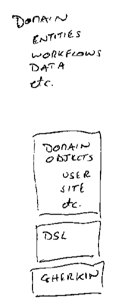

footer: @EvilTester | Copyright © 2019, Compendium Developments Ltd
slidenumbers: true
Autoscale: true

<!-- footer: @EvilTester | Copyright © 2019, Compendium Developments Ltd -->
<!-- page_number: true -->

# Hands on exploration of Page Objects and Abstraction Layers with Selenium WebDriver

## A Tutorial Workshop

- Alan Richardson
- @eviltester

alan@compendiumdev.co.uk

- www.EvilTester.com
- www.CompendiumDev.co.uk
- www.JavaForTesters.com
- www.SeleniumSimplified.com

---

# Introduction

---

After gaining some experience of web automation tools, you start to realise that “yes, you have to learn the API”, but the real challenge is modeling the application and building an abstraction layer which supports different approaches to automation. And when we build an abstraction layer, we have lots of options to choose between.

---

- Do you use the Page Factory?
- What counts as a page object?
- Should a page object offer logical functions like “loginAs” or does it only model the physical world?

---

- How do we deal with navigation? Return page objects, or with a different set of objects?
- Do we need abstractions for Dom elements like input fields or is WebElement enough?
- When do we synchronise with WebDriverWait and when do we use SlowLoadableComponent?
- Should we build our own abstractions on top of SlowLoadableComponent?

---

By using a simple web application, we will use these, and other questions, to discuss and experiment with, the most challenging parts of Web Automation – the modeling and construction of robust and re-usable abstraction layers.

Existing practitioners, be prepared to discuss the choices you have made in the past, what worked, and what didn’t, so that we can learn and possibly build on some of those decisions.

---

This is open to novices and experienced practitioners, but if you want to take part then make sure you have a functioning Selenium WebDriver installation. All examples will be presented using Java, but that doesn’t stop you writing experiments in Python, .Net, or whatever other language you favour.

Bring your laptop, and you’ll have the opportunity to explore different ways of building Page Objects and abstraction layers.

---

# What Will We Cover?

~~~~~~~~
* Intro
* General Abstractions Overview
* Abstraction Approaches Overview & Discussions
* Modelling
* Example Implementations
* Additional Approaches
* Hands on Exercises
* Debriefs & Wrap Ups
~~~~~~~~

<!--

---

# Logistics & Plan For Half Day Workshop

*   11:00 – 12:30 == 1.5
    *   Intro
    *   General Abstractions Overview
    *   Example Implementations & Discussions
    *   Exercise (till lunch)
        *   Given some scenarios, create some tests and abstraction layers to support your tests
*   13:30 – 15:00 == 1.5
    *   Continue exercises and debrief
    *   Examples and Comparison with group
    *   Exercise (till end)
    *   Adjust your code, refactor to other approaches

# Logistics for 3 Hours

- take breaks when you need during exercises

* Introduction, Exercise: download code get it working
* Abstraction Concepts,  Abstraction Approaches Overview, Frameworks Vs Libraries, Modelling
* Example Implementations 15/15

-->

---

# Code Examples & Slides

*   [github.com/eviltester/automationAbstractions](https://github.com/eviltester/automationAbstractions)
*   link to slides

The code uses Maven, Java 1.8 (or above), everything is brought down as a dependency using Maven - you do not need to install WebDriver or Drivers. You do need to have Chrome (recommended), or Firefox, or Safari.

---

# Tour of the Code

- pom.xml
   - dependencies
   - web driver manager
- examples
   - uk.co.compendiumdev.examples
   - simple worked examples with exercises

---

# Tour of the code - Case Studies

- casestudybasic
   - a basic test with no abstractions to refactor to page objects or other components
- casestudyexample
   - an existing test with existing abstractions, fix, refactor, explore
- casestudyrefactor
   - a test with a single page object, good basis to refactor from

---

# Experiences Check

*   Used WebDriver?
*   What Languages?
*   Abstraction Layers?
*   Frameworks?
*   Current setup
    *   Laptop With You? Ready to code?

---

# Abstraction Concepts

---

# What is Abstraction?

*   Discuss

---

# Abstraction

*   Modelling
*   Separation of concerns
*   Logical vs Physical
*   Functional vs Structural
*   Interfaces vs Implementations
*   Data / Entities / Persistence

---

# Abstraction

*   Functionality / Task Flow
*   Goals / Strategies
*   Layers – GUI, DB, HTTP
*   Etc.

---

# What does abstraction look like?

---

# Example Test Without Abstraction

_NoAbstractionTest.java_

_shown on next slide_

---

~~~~~~~~
@Test
public void canCreateAToDo(){
    WebDriver driver = new ChromeDriver();      
    String siteURL = "http://todomvc.com/examples/backbone/";
    driver.get(siteURL);

    int originalNumberOfTodos = driver.findElements(
                  By.cssSelector("ul.todo-list li")).size();

    WebElement createTodo = driver.findElement(
                    By.className("new-todo"));
    createTodo.click();
    createTodo.sendKeys("new task");
    createTodo.sendKeys(Keys.ENTER);
    Assertions.assertTrue(driver.findElement(
                    By.className("filters")).isDisplayed());

    int newToDoCount = driver.findElements(
                  By.cssSelector("ul.todo-list li")).size();
    Assertions.assertTrue(newToDoCount >
                          originalNumberOfTodos);
    driver.close();
    driver.quit();
}
~~~~~~~~

---

## But there are abstractions

- ChromeDriver
- WebDriver
- Variable Names, Method Names
- Library Method calls
- Assertion Libraries
- JUnit Test Runner and Annotations

---

# Example Test With Abstraction

_WithAbstractionTest.java_

_shown on next slide_

---

~~~~~~~~
@Test
public void canCreateAToDo(){

    WebDriver driver = new ExecutionDriver().get();

    TodoMVCUser user = new TodoMVCUser(driver,
                            new TodoMVCSite());
    user.
         opensApplication().
         and().
         createNewToDo("new task");

    TodoMVCPojoPage page =
                           new TodoMVCPojoPage(driver,
                            new TodoMVCSite().getURL());

    assertThat(page.getCountOfTodoDoItems(), is(1));
    assertThat(page.isFooterVisible(), is(true));

    ExecutionDriver.closeDriver(driver);
}
~~~~~~~~
---

## What Abstractions?

- `@Before, @After` - abstract setup and tear down
- driver creation _using ExecutionDriver_
- environment url management _using TodoMVCSite_
- User Workflow abstraction _TodoMVCUser_

---

## What Abstractions?

- Application page abstractions _ApplicationPageFunctional_
- test method and variable naming
- assertions from HamCrest

---

# Why do we use Abstractions?

- Discussion

---

# Why Abstraction?

* Change implementations easily
* Single Responsibility – only changes when necessary
* Makes automation readable and maintainable
* When app changes, fewer changes to test code
* Code Completion when writing code

---

“...The name of the song is called ‘Haddocks' Eyes.’”

“Oh, that's the name of the song, is it?" Alice said, trying to feel interested.

“No, you don't understand,” the Knight said, looking a little vexed. “That's what the name is called. The name really is ‘The Aged Aged Man.’”

- Lewis Carroll, Through The Looking Glass

---

“Then I ought to have said ‘That's what the song is called’?” Alice corrected herself.

“No, you oughtn't: that's quite another thing! The song is called ‘Ways And Means’: but that's only what it's called, you know!”

“Well, what is the song, then?” said Alice, who was by this time completely bewildered. “I was coming to that,” the Knight said. “The song really is ‘A-sitting On A Gate’: and the tune's my own invention.””

- Lewis Carroll, Through The Looking Glass

---

# “The purpose of abstraction is not to be vague, but to create a new semantic level in which one can be absolutely precise.”

## Edsger Dijkstra

## The Humble Programmer

[www.cs.utexas.edu/~EWD/transcriptions/EWD03xx/EWD340.html](https://www.cs.utexas.edu/~EWD/transcriptions/EWD03xx/EWD340.html)

[www.cs.utexas.edu/~EWD/ewd03xx/EWD340.PDF](https://www.cs.utexas.edu/~EWD/ewd03xx/EWD340.PDF)

---

# “I must create a system. or be enslav'd by another Mans; I will not reason & compare: my business is to create”

## William Blake, Jerusalem: The Emanation of the Giant Albion

[http://www.blakearchive.org/search/?search=%22must%20create%20a%20system%22](http://www.blakearchive.org/search/?search=%22must%20create%20a%20system%22)

[http://www.blakearchive.org/copy/jerusalem.a?descId=jerusalem.a.illbk.10](http://www.blakearchive.org/copy/jerusalem.a?descId=jerusalem.a.illbk.10)

---

# Lessons from Quotes

- names are easy to change
- multiple nested abstractions
- precision
   - create new layers when required
   - don't shove everything in one class

---

# Lessons from Quotes

- flexibility, not control
   - make it easy to get the thing abstracted
- abstractions for 'common' items
- decision making (and re-making)

---

# Abstraction Approaches Overview

---

# Abstraction Layers Categorised

*   **Data**
*   **Physical**
*   **Domain**
*   **Logical**
* **etc.**

---

# Abstraction Layers Categorised

*   **Data**
    *   Generic Data Abstractions e.g. email, postcode
*   **Physical**
    *   Physical layout of your application e.g. pages, components
    *   Navigation across pages

---

# Abstraction Layers Categorised

*   **Domain**
    *   Your application Entities domain e.g. user, account
*   **Logical**
    *   User actions, workflows
* **etc.**

---

# Common Automation Abstractions

*   Page Objects
*   Element Abstractions: select, textbox, etc.
*   Domain Objects, Infrastructure
*   Gherkin (Given/When/And/Then)
*   Domain Specific Languages
*   Any More?

<!--

Any more exercise:

    *   Create a List to discuss
    *   Any public examples?
    *   Any examples in the room that can be shared?

-->

---

# Abstractions - Domain

---

# Abstractions - APP

---

# Abstractions - DOM

---

# Abstraction != Implementation

*   Abstraction != Tool / Framework / Implementation
*   Gherkin != Cucumber
*   Page Object != Page Factory
*   Domain Specific Language != Keyword Driven

## If we want to get good at abstraction then we need to model, split apart, and make the relationships clear

---

# WebDriver is an Abstraction Layer

*   Dom Abstraction
    *   WebElement
*   Browser Abstraction
    *   WebDriver
        *   FireFox, Chrome, Remote etc.
*   HTML Abstractions
    *   Cookies, Frames, etc.
*   'Support' classes augment WebDriver
    *   e.g. _com.seleniumsimplified.selenium.support_

---

# Frameworks vs Libraries

---

# Frameworks vs Libraries

- Frameworks
   - Control
   - Can only do what Framework allows
   - Calls your code

_What else?_

---

# Frameworks vs Libraries

- Libraries
   - Freedom
   - Can be abstracted
   - Used for multiple purposes e.g. functional, performance, exploratory
   - You call it

_What else?_

---

# What is it? Framework or Library?

- JUnit
- WebDriver
- AssertJ, HamCrest
- A Base Test Class that we extend

_Discuss. Other Examples? Pros & Cons?_

---

# Code Coverage & Unit Testing

We write @Test methods that use abstractions to do stuff.

- Do we write Unit Tests for our @Test code?
- Do we write Unit Tests for our Abstraction Layers?
- Do we run our @Test with code coverage?

_see coverage package_

<!--

Code coverage can help us identify risks in our abstraction libraries.

If we run our tests with code coverage on, and see that there are
unused parts of our abstraction layers. Then we don't know if they still
execute. So the next time someone tries to use the abstraction layer, it
might fail. And they have to spend time debugging the abstraction layer
but they might also not know it is the abstraction layer since that is a
trusted part of our code. So they waste time 'blaming' their @Test method
or the area of functionality that they are trying to automate.

Periodically running the automated execution with code coverage to check how
well the abstraction layers are covered can help mitigate this risk.

It might reveal:

- unused parts of the abstraction layers because they are old
  and not longer required.
- unused parts of abstraction layer that have never been used and
  are risky.
- parts of the application that are not exercised because the
  abstraction layers are not used.

-->

---

# Modelling

---

# Model the application under test

The key to effective abstractions is modelling.

---

# Given an App – todomvc.com

---

# TodoMVC.com Functional Overview Demo

*   Single Page App
*   Shows Counts
*   Data held in HTML5 local storage
*   Create/Edit/Complete a 'todo'
*   Clear Completed
*   Filter active/completed/all
*   Delete a todo

---

# Exercise Given an App – todomvc.com

*   What Abstractions might we build?
*   What thoughts do we have?
*   What underpins our analysis?
*   What might be hard?
*   What risks are there?
   - that impact our automating and modelling

## _...Then Debrief_

---

# Modelling

Our code is a model of the application
- `@Test` - flows
- Abstraction Layers
   - models with a point of view
    - we can model the same page in different ways
- Method, Class, Variable Naming
    - our Ubiquitous Language
- Models reveal coverage
    - review Page Objects might reveal gaps in testing
    - if it isn't modelled, it isn't covered.

---

# Example Implementations

---

# Example Implementations

- Infrastructure - downloading dependencies and setting up tools
- Driver Abstractions - don't instantiate drivers directly use an abstraction
- Environment Abstractions - config abstraction, e.g. don 't code URLs into test
- Element Abstractions - alternative to WebElement e.g. CheckBox, Select etc.
- Page Object - model the page as common actions or physical elements
- Fluent Page Objects - allow method chaining for readable tests avoiding BDD DSL tools
- Navigation Abstractions - separate navigation from actions, so pages don't have to know about other pages

---

# Example Implementations

- Component Abstractions - common chunks of the page as separate classes
- Domain Abstractions - model the domain and work with data, or ubiquitous language
- Gherkin as DSL Abstraction - using BDD style tools for DSL creation
- Assertion Abstractions - different assertion approaches separate from test execution
- Base Test - framework style implementation of abstraction layers
- Browser Abstractions - access cookies, local storage etc.
- Workarounds - abstractions to help work around bugs, limitations, in tooling

---

# Infrastructure

---

# Infrastructure Abstraction

- Maven and other dependency management tools
- WebDriverManager - downloads drivers

e.g. see _InfrastructureTest_

---

# Maven

Downloads dependencies.

e.g. https://github.com/bonigarcia/webdrivermanager

~~~~~~~~
<dependency>
    <groupId>io.github.bonigarcia</groupId>
    <artifactId>webdrivermanager</artifactId>
    <version>3.6.2</version>
    <scope>test</scope>
</dependency>
~~~~~~~~

---

# WebDriver Manager Usage

~~~~~~~~
@Test
public void ensureChromeDriverIsAvailable(){

    WebDriverManager.chromedriver().setup();
    WebDriver driver = new ChromeDriver();

    final TodoMVCSite todoMVCSite = new TodoMVCSite();
    driver.get(todoMVCSite.getURL());

    driver.close();
    driver.quit();
}
~~~~~~~~
---

# Infrastructure Abstractions

Abstraction is not just in your source code.

- downloading, setup, install
   - chocolatey, homebrew
   - custom scripts
- configuration
   - support multiple approaches (ability to override at different levels)
       - global machine, command line, local in IDE, default

---

# Pros / Cons

- Pros?
- Cons?

---

# Pros / Cons

- Pros
   - Makes WebDriver installation simpler
   - Less to manage in version control
- Cons
   - May reduce technical understanding of WebDriver
   - Which might impact adoption of cloud execution
   - Dependent on version manager updates

---

# Driver Control Abstractions

---

# Driver Manager Abstractions

A common abstraction for Web GUI automating

~~~~~~~~
WebDriver driver = Driver.get();
~~~~~~~~

- `Driver` allows us to abstract away the configuration of browsers
- To run our tests on multiple browsers without changing the test

We have to be careful not to have this limit us.

_see DriverManagerTest_

---

# Driver Manager Options

- Cached browsers to re-use browser
- Creating uncached 'unique' browsers
- Static fields for all tests
- Unique browser per @Test to support parallelism
- Configuration via Environment Variables or System Properties
- Configuration via methods
- etc.

This can become complicated e.g.

- [github.com/eviltester/selenium-driver-manager](https://github.com/eviltester/selenium-driver-manager)

---

# Driver Manager Pros & Cons

- Pros?
- Cons?

---

# Driver Manager Pros & Cons

- Pros
    - Easy to run tests on different browsers without changing test code
    - Easy to handle changes in how browsers startup or close
    - Central place to control extensions etc.
- Cons
    - Can become complicated
    - People don't learn how to initiate or configure browsers
    - When baked into a framework can be harder to configure and use on an adhoc basis

---

# Environment Abstractions

---

# Environment Abstraction Example

~~~~~~~~
driver.get("https://test.myenv.com");
~~~~~~~~

Instead delegate the handling of information to other classes.
       
~~~~~~~~
final AppEnv myenv = new AppEnv();
driver.get(myenv.getURL());
~~~~~~~~

_see EnvironmentAbstractionTest_

---

# Environment Abstractions

- helps us avoid hard coding in our test:
    - urls,
    - usernames,
    - passwords,
    - etc.
       
A 'Config' abstraction.

---

# Sensitive Data

Because these classes often contain sensitive data they are likely to:

- configure themselves from System Properties e.g. JVM -D parameters
- configure themselves from Environment Variables
- throw runtime exceptions if data not set
- possibly have non-sensitive defaults

---

# Environment Abstraction Pros and Cons

- Pros?
- Cons?

---

# Environment Abstraction Pros and Cons

- Pros
    - switching between environments becomes easier
- Cons
    - can become complicated
    - often not enough flexibility e.g. config by file, harder to amend at runtime

---

# Element Abstractions

---

# Element Abstractions

---

# Element Abstraction Examples

~~~~~~~~
public interface Checkbox {
   public boolean isChecked();
   public Checkbox check();
   public Checkbox uncheck();
   public Checkbox toggle();
}
~~~~~~~~

* Would you include 'toggle'?
* Does it need to be an interface?

---

# Element Abstraction Examples

~~~~~~~~
public class CheckboxHTMLElement implements WrapsElement {

    private final WebElement webelement;

    public CheckboxHTMLElement(WebElement element){
        webelement = element;
    }

    public boolean isChecked() {
        return webelement.isSelected();
    }

    public void check() {
        if(!isChecked())
             toggle();
    }
//...
~~~~~~~~

---

# Element Abstractions

*   Existing support: Select,
*   Possible: TextBox, Checkbox, TextBox, File etc.
*   `WrapsElement` enforces a 'standard' for abstractions
*   Can enforce Semantics
    *   Checkbox: isChecked, check(), uncheck(), toggle()
    *   TextBox: clear(), enterText()
    *   etc.
*   Pass back from Page Objects into test?
*   e.g. _Checkbox in elementabstraction_
    *   new CheckBox(element)

---

# Element Abstraction Pros and Cons

- Pros?
- Cons?

---

# Element Abstraction Pros and Cons

- Pros
   * Can help 'restrict' code i.e. check or uncheck, rather than click
   - enforces 'semantics'
- Cons
   * May have to create a custom page factory if using annotations
   * not returning the WebElement may restrict people using your library

---

# Page Objects Theory

---

# Page Objects

*   The most obvious automation abstraction
*   What is it?
    *   A page? A Component?

*   Experiences?
*   Do web applications still have pages?

---

# Example

~~~~~~~~
public class TodoMVCPojoPage {

    private static final By TODO_ITEMS = By.cssSelector(
                           "ul.todo-list li:not(.hidden)");
    private final WebDriver driver;
    private final String url;

    public TodoMVCPojoPage(WebDriver driver, String url) {
        this.driver = driver;
        this.url = url;
    }

    public List<WebElement> getTodoItems() {
        return driver.findElements(TODO_ITEMS);
    }

    //... see TodoMVCPojoPage.java and TodoMVCPojoTest.java
    //... package uk.co.compendiumdev.examples.pojo;
~~~~~~~~

---

# Page Object Design Decisions

*   What methods does it have?
    *   Functional
        *   login(username, password),
        *   loginAs(user)
    *   Structural
        *   enterName(username), enterPassword(password), clickLogin(), submitLoginForm(username, password)
*   Does it expose elements or not?
    *   public WebElement loginButton;
    *   public WebElement getLoginButton();
    *   public clickLoginButton();

---

# Navigation Design Decisions

*   Does a Page Object return other pages?

~~~~~~~~
public IssueListPage submit(){
    driver.findElement(By.id(“submit”)).click();
    return new IssueListPage(driver);
}
~~~~~~~~~

*   Pros?
*   Cons?
*   Experiences

---

# Page Objects

*   What rules / guidelines / biases do you use for page objects?

---

# Possible Rules

- No constructors, static factory methods
- Do not expose WebElements
- Never Return other Page Objects
- Physical Actions, not logical
- Only logical actions, not physical

---

# Implementing Page Objects

* POJO
* Page Factory
* LoadableComponent
* SlowLoadableComponent
* Functional vs Structural
* Fluent Interfaces
* Other approaches?

---

# Implementing Page Objects

*   POJO
    *   Plain object, driver in constructor, methods use driver.<method>
*   Page Factory
    *   Annotated elements, lazy instantiation via reflection
*   LoadableComponent
    *   Common interface (load, isLoaded), isLoaded throws Error
*   SlowLoadableComponent
    *   Common interface, waits for on isLoaded
*  Functional vs Structural
    * type of methods represent user actions or physical actions
*  Fluent Interfaces
    - to support method chaining for readable tests
*   Other approaches?

---

# Code Examples

_see packages uk.co.compendiumdev.examples_

- pojo,
- pagefactory,
- navigation,
- structuralvsfunctional,
- synchronisedcomponent,
- component

---

# POJO

---

# POJO Example

~~~~~~~~
public class TodoMVCPojoPage {

    private static final By TODO_ITEMS = By.cssSelector(
                             "ul.todo-list li:not(.hidden)");
    private final WebDriver driver;
    private final String url;

    public TodoMVCPojoPage(WebDriver driver, String url) {
        this.driver = driver;
        this.url = url;
    }

    public List<WebElement> getTodoItems() {
        return driver.findElements(TODO_ITEMS);
    }

    //... see TodoMVCPojoPage.java and TodoMVCPojoTest.java
    //... package uk.co.compendiumdev.examples.pojo;
~~~~~~~~

---

# POJO

* Simple Class
* WebDriver passed to constructor
* Refactor to Composition of any components
* Single Responsibility?
    - Model Physical Page?
    - Model Common Functions use on the page?

_see pojo \ TodoMVCPojoPage , other examples in the code base_

---

# POJO Discussion

*   Pros
*   Cons

---

# POJO Discussion

*   Pros
   * easy to maintain
   * simple to understand and extend, requires basic java knowledge
   * easy to add synchronisation
*   Cons
   * might not have a common interface e.g. 'get', 'load', 'waitForReady'
   * easy to add too many methods and try to do too much

---

# Page Factory

---

# Page Factory Example

~~~~~~~~
@FindBy(how = How.CSS, using="#todo-count strong")
private WebElement countElementStrong;

@FindBy(how = How.CSS, using="#todo-count")
private WebElement countElement;

@FindBy(how = How.CSS, using="#filters li a")
List<WebElement> filters;

public ApplicationPageStructuralFactory(WebDriver driver,
                                TodoMVCSite todoMVCSite) {

   PageFactory.initElements(driver, this);
   this.driver = driver;
   //...
~~~~~~~~

---

# Page Factory

*   Annotate fields with @FindBy
*   Instantiate in constructor using PageFactory.initElements
    *   Can create your own page factory initialiser

_compare pagefactory package with pojo_

---

# Page Factory Discussion

*   Pros
*   Cons

---

# Page Factory

*   Pros
    - fast to get started
    - annotated elements can be used in WebDriverWait Expected Conditions that take WebElement parameters
*   Cons
    - people often forget about synchronisation
    - easy to fall back on implicit wait to fix synchronisation problems
    - too easy to make WebElements public
    - doesn't handle relative element finding easily
    - people can find it hard to mix method and annotation approach

---

# Functional vs Structural

---

# Functional vs Structural

Model the functions the page exposes, or the physical structure of the page.

*   Functional
    *   loginAs(username, password)
    *   loginAs(user)  // understands domain
*   Structural
    *   enterUsername(username)
    *   enterPassword(password)
    *   clickLoginButton()
    *   submitLoginForm(username, password)
    *   getLoginButton()

---

# Functional can 'use' the Structural

~~~~~~~~
private StructuralPage structure;

public FunctionalPage(WebDriver driver,
                      TodoMVCSite todoMVCSite) {
     structure = new StructuralPage(driver, todoMVCSite);
}

public int getCountInFooter() {
    // if there is an exception because count is not visible
    // then there are 0 items
    try{
        return structure.getCountInFooter();
    }catch(Exception e){
        return 0;
    }
}

public void filterOnAll() {
    structure.clickOnFilter(0);
}
~~~~~~~~

---

# Functional Vs Structural Pros and Cons

- Pros?
- Cons?

---

# Functional Vs Structural Pros and Cons

- Pros
   - simple modelling approach
- Cons
   - might be too simple a model
   - might be confusing - what is logical, what is physical?
   - delegating from functional to structural seen as unnecessary maintenance

---

# Functional Vs Structural Pros and Cons

- Many page objects are a mix of both - Pros? Cons?
- How far could structural go?
    - a data object that manages By locators?
    - methods to do stuff, and locators?
         - should locators be public?

_see package structuralvsfunctional_

*   One way of answering “what methods to put on a page object”
    * Is it functional / behavioural?
    * Is it structural?
    * 'logical' vs 'physical'?
*   Functional 'uses' Structural implementation

---

# Fluent Page Objects

---

# Fluent Page Objects

- Allow writing tests in DSL type manner

e.g.

~~~~~~~~
page.
    open().
    and().
        createTodo("My First Todo").
        createTodo("M
    then().
        toggleTodoStatus(1);
~~~~~~~~

_see fluent package_

---

# Fluent Page Object Implementation

~~~~~~~~
public FluentTodoMVCPage createTodo(String name){
    return typeIntoNewToDo(name + Keys.ENTER);
}

public FluentTodoMVCPage open() {
    driver.get(url);
    return this;
}

public FluentTodoMVCPage and(){
    return this;
}

public FluentTodoMVCPage then(){
    return this;
}
~~~~~~~~

---

# Fluent Page Objects

*   Methods return the page object or other objects to allow method chaining
*   Instead of
    *   void clickDeleteButton();
    *   PageObject clickDeleteButton();
*   Syntactic sugar methods:
    *   and(), then(), also()
*   Work well at high levels of abstraction

---

# Fluent Page Objects Pros and Cons

- Pros?
- Cons?

---

# Fluent Page Objects Pros and Cons

- Pros
   - code completion makes writing test code easier
   - static Factory methods can be used to avoid `new Page`
   - code is easy to read
   - might avoid needing a BDD framework
- Cons
   - can encourage long 'sentences' in the test code
   - chains can get deep if not careful about objects returned

---

# Loadable Component

---

# Loadable Component

- Extending LoadableComponent provides a common interface for 'get'ing pages.
- With an inbuilt erroring mechanism to check if on correct page

_see SynchronisedComponentPojoPage_

---

# Loadable Component Example

~~~~~~~~
public class SynchronisedComponentPojoPage extends
                                LoadableComponent {
//...
    @Override
    protected void load() {
        driver.get(url);
    }
    @Override
    protected void isLoaded() throws Error {
        boolean loaded = false;
        try{
            if(driver.findElement(
                  By.className("new-todo"))!=null){
                loaded = true;
            }
        }catch (Exception e){
        }
        if(!loaded){
            throw new Error("page not loaded");
        }
    }
//...
~~~~~~~~

---

# Loadable Component

* Extends LoadableComponent
    * Get
        * If isLoaded, return this
        * Else load()
        * Check isLoaded()
* Implement _load_
    * _Add any synchronisation in **load** to wait for the loading. Exit only when 'loaded'._
* Implement _isLoaded_
    * _Check, and **throw Error** if not loaded_

---

# Loadable Component Pros & Cons

- Pros?
- Cons?

_see SynchronisedComponentPojoPage_

---

# Loadable Component Pros & Cons

- Pros
   - provides a common interface to 'pages' and 'components' i.e. `get`
   - can make isLoaded public if necessary
- Cons
   - Uses Error instead of Exception

---

# Loadable Component

- Because of the use of 'error', I tend not to use this
- But I do use the concept of a single interface
- and I like the notion of 'isLoaded' but I prefer it to return a boolean and create a custom 'ExpectedCondition' for detecting if 'isLoaded'

---

# Synchronisation

---

# Synchronisation

- The most important concept for reliable execution
- basically
   - wait for something to be ready,
   - then interact with it
- Can be done at any level - page, page load, element methods, functions

---

# Implicit or Explicit Wait?

- Implicit Wait
   - configure once in WebDriver and all findElement calls will 'wait' for the element
- Explicit Wait
   - explicitly use `new WebDriverWait(driver, 5).until(...)` in our code

---

# Implicit Wait

~~~~~~~~
driver.manage().timeouts().
    implicitlyWait(15L, TimeUnit.SECONDS);
Assertions.assertTrue(
          driver.findElement(
              By.id("filters")).
                 isDisplayed());
~~~~~~~~

The findElement 'waits' until element is in DOM before `isDisplayed`

---

# Explicit Wait

~~~~~~~~
driver.manage().timeouts().
implicitlyWait(0L, TimeUnit.SECONDS);

WebDriverWait wait = new WebDriverWait(driver,15);

wait.until(ExpectedConditions.
                elementToBeClickable(By.id("filters")));
~~~~~~~~

_Example: firsttests / WebDriverWaitTest.java_

---

# Simple Example

Instead of:

~~~~~~~~
WebElement createTodo =
        driver.findElement(By.className("new-todo"));
~~~~~~~~

~~~~~~~~
WebElement createTodo =
               new WebDriverWait(driver,10).
                     until(ExpectedConditions.
                         visibilityOfElementLocated(
                            By.className("new-todo")));
~~~~~~~~

_Thoughts? Discuss?_

<!--

This uses the concept of wait and return.

Sometimes we might wait, and then interact as two different statements.

This makes it clear that waiting doesnt' add more to the 'test' than before.

Issues?

- If element is not present then test is slower to report a problem
- creating a wait all the time
- what timeout should we use?
- where should be synchronise- on each element usage or at a component load level?

-->

---

# Thoughts?

- Implicit Wait or Explicit Wait?
- Synchronise in Tests or Abstraction Layers?

---

# Navigation

---

# Navigation Options

Navigation is often not thought about.

Many people default to methods that navigate returning new Page objects for the navigation path.

Options:

*   Direct in Test e.g. `driver.get`
*   Instantiate new pages based on test flow
*   Page Object methods might return other Pages
*   We might use navigation objects

_see navigation package_

---

# Navigation Using Test Flow

*   Instantiate new pages based on test flow
    *   Navigation as side-effect, may have to bypass 'get'
    *   Loadable pages, non-loadable, support classes

~~~~~~~~
allPage.clickOnActiveFilter(); // causes page change
activePage = new ActiveToDosPage(driver, todoMVCSite);
activePage.waitUntilLoaded();
   Assertions.assertEquals(4, countVisibleTodos());
~~~~~~~~

---

# Page Object Return Other Pages

*   e.g. a method on the login page might be
      *   MyAccountPage clickLogin();
            *   Returns a new page
      *   void clickLogin();

~~~~~~~~
ActiveToDosPage activePage = allPage.clickOnActiveFilter();
activePage.waitUntilLoaded();
~~~~~~~~

---

# Navigation objects

* direct, or Path based (current page → desired page)
    *   Navigate.to(MyAccountPage.class)
    *   Jump.to(MyAccountPage.class)

~~~~~~~~
new TodoMVCNav(driver, todoMVCSite).
           open(ACTIVE_TODOS_PAGE);
~~~~~~~~

---

# Navigation Options Pros and Cons

- Pros?
- Cons?

_see navigation package_

---

# Navigation Options Pros and Cons

- Pros
    - separate navigation means reduced maintenance
    - make test responsible for knowing navigation path
    - navigation object means reducing test maintenance
- Cons
    - pages returning other pages increases responsibility and maintenance
        - i.e. page also has to know about app flow
    - what if an action has multiple options e.g. `clickLogin()` `clickLoginBad()`
    - inconsistency in page object methods, some return pages, some don't
    - encourages method chaining without fluency

---

# Component Abstractions

---

# Component Abstractions

*   Components on the screen
    *   e.g. `component` package
*   e.g. `VisibleToDoEntry`, `Filters`, `Footer`, `Header`, `VisibleToDoList`, etc.
*   Could have 'functional' representation for repeated items e.g. login forms
*   Could have 'structural' representation
*   Likely use : page object composition

---

# Component Abstraction Example

~~~~~~~~
VisibleToDoEntry todo;
todo = VisibleToDoEntry.getToDoAt(driver, 1);
todo.edit("visible todo");
todo.markActive();
~~~~~~~~

_see `component` package_

---

# Pros & Cons of Component Abstractions

- Pros?
- Cons?

---

# Pros & Cons of Component Abstractions

- Pros
   - can synchronise at component level
   - more semantic interaction
   - avoiding overloading page with methods
   - reduced maintenance of page objects
- Cons
   - might lead to page methods duplicating component functionality
   - pages returning components might lead to too much method chaining

---

# Synchronised Components

---

# SlowLoadable Component Example

* same interface as LoadableComponent but 'get' is a synch mechanism
* Extends SlowLoadableComponent
* Constructor has to additionally call
    * super(new SystemClock(), 10);
    * Where 10 is a timeout # of seconds
* _**get()**_
    * If isLoaded then return this Else load
    * While not loaded{ wait for 200 millseconds}
* Implement _**load**_ and _**isLoaded**_
    * But can remove sync loops from load

---

# SlowLoadableComponent Example

~~~~~~~~
public class TodoEditField extends SlowLoadableComponent {
private final WebDriver driver;

public TodoEditField(WebDriver driver) {
    super(Clock.systemDefaultZone(), 20);
    this.driver = driver;
}
@Override
protected void load() {}

@Override
protected void isLoaded() throws Error {
    try {
        WebElement element = driver.findElement(
                    By.cssSelector("li.editing input.edit"));
        if (element.isEnabled() && element.isDisplayed()) {
            return;
        }
    }catch(Exception e){}
    throw new Error("Component not loaded");
}
//...
~~~~~~~~

---

# Example in Code

_synchronisedcomponent \ TodoEditField_

---

# SlowLoadable Component Discussion

*   Pros?
*   Cons?

---

# SlowLoadable Component Discussion

*   Pros
    - consistent interface
    - encourages creation of components
*   Cons
    - throws error not exception
    - synchronisation requires a `get` but semantically that might wrong i.e. component exists, why `get` it?

---

# Domain Abstractions

---

# Possible Domain Abstractions

*   Logical Objects
    *   ToDo
    *   ToDoList
*   Physical Objects
    *   LocallyStoredToDo
*   Actors
    *   User
*   Environment
    *   Site
    *   Implementation
- Actions
    * TodoActions (high level activities) e.g. `createMultipleTodos`

---

# Example Usage for Functional

~~~~~~~~
user.
    createNewToDo("My First Todo").
    and().
    createNewToDo("My Second Todo");
~~~~~~~~

_see DomainTest_

---

# Random Data

- Domain objects make random data easier to manage

~~~~~~~~
RandomTodoGenerator rnd =
      new RandomTodoGenerator();
myTodos.addNewToDoItem(
       rnd.getRandomTodoName());
~~~~~~~~

_Discus_

---

# Page Objects & Domain Objects

*   Instead of
    *   `todoMVC.enterNewToDo(“New Item”)`
*   We could have have
    *   `ToDoItem newItem = new ToDoItem(“New Item”);`
    *   `todoMVC.enterNewToDo(newItem);`
*   Discuss

_See code in DomainBasedTest_

---

# Domain Objects That Span Logical & Physical

e.g. User

*   user.createNewToDo(“new item”)
*   user.createNewToDo(newItem)

*   Discuss

_See use in NoAbstractionTest_

---

# Domain Objects Pros & Cons

- Pros?
- Cons?

---

# Domain Objects Pros & Cons

- Pros
    - more semantic tests
    - random data can expand coverage
    - can make tests smaller
    - delegate to other objects to reduce maintenance
- Cons
    - coupling might mean more maintenance if domain changes
    - random data needs management - logging and seeding
    - how far should domains be mixed?
         - should a page know about a TodoItem object?
         - or just the text of the todo?

---

# Gherkin as an abstraction layer

---

# Gherkin as an abstraction layer

~~~~~~~~
Feature: We can create and edit To Do lists in ToDoMvc

We want to amend todos in ToDoMVC because that is
the set of exercises on the abstraction tutorial

Scenario: Create a ToDo Item
 Given a user opens a blank ToDoMVC page
 When the user creates a todo "new task"
 Then they see 1 todo item on the page
~~~~~~~~

---

# About Gherkin Usage

*   Implement steps using highest appropriate abstraction layer
*   CucumberJVM as 'DSL implementor'
*   'Expressibility' vs 'Step Re-use'
*   See `todomvc.feature` and `domaindslcucumberjvm` package

---

# Gherkin / Cucumber Pros and Cons

- Pros?
- Cons?

---

# Gherkin / Cucumber Pros and Cons

- Pros
   - easy to use DSL creation
   - easy data driven functionality
- Cons
   - people think they are 'doing BDD'
   - people try to use for everything
   - code embedded in step rather than abstraction forces use of Cucumber
   - more skills required on team
   - should we create a feature or a test? splits focus

---

# Assertion Abstractions

---

# Assertion Abstractions

- Assertions are important for keeping `@Test` code readable
- Self-documenting assertions can make it easier to understand the test fast
- Assertion abstractions can usually be mixed across Cucumber, and Test Execution Frameworks

---

# Junit 5 Example

~~~~~~~~
Assertions.assertEquals(0,
              todoMVC.getTodoItems().size());
~~~~~~~~

~~~~~~~~
org.opentest4j.AssertionFailedError:
Expected :0
Actual   :1
~~~~~~~~

---

# Junit 4 and JUnit 5

- Junit 4 `Assert.`
- Junit 5 `Assertions.`
- Hamcrest built in

---

# Hamcrest Example

~~~~~~~~
assertThat(todoMVC.getTodoItems().size(), is(0));
~~~~~~~~

~~~~~~~~
java.lang.AssertionError:
Expected: is <0>
     but: was <1>
Expected :is <0>
Actual   :<1>
~~~~~~~~

---

# Hamcrest

- english language syntax
- static inclusion of 'is' etc.
- More readable error messages than JUnit
- http://hamcrest.org

---

# AssertJ Example

~~~~~~~~
assertThat(todoMVC.getTodoItems().size()).isEqualTo(0);
~~~~~~~~

~~~~~~~~
org.opentest4j.AssertionFailedError:
Expecting:
 <1>
to be equal to:
 <0>
but was not.
Expected :0
Actual   :1
~~~~~~~~

---

# AssertJ

- method chaining can make it easier to build assertions with less knowledge of the library
- has SoftAssertions to allow multiple assertions 'fail' in test
- has BDD style assertion `then`

~~~~~~~~
todoMVC.editItem(0, "Edited Todo");
then(todoMVC.getTodoItems().size()).isEqualTo(1);
~~~~~~~~

---

# Assertion Library Pros and Cons

- Pros?
- Cons?

---

# Assertion Library Pros and Cons

- Pros
   - flexibility of how you want assertions to read
   - can improve on error understanding by using a different framework
   - different libraries can make assertions easier to write
- Cons
   - might be harder to switch if existing tests
   - need to learn an Assertion library as well as an execution framework
   - soft asserts might encourage too many assertions in same test

---

# Base Test

---

# Base Test Case Example

~~~~~~~~
public class BaseClassExampleTest
                 extends SeleniumBaseTestCase {

    @Test
    public void canUseADefaultBrowser(){

        final TodoMVCSite todoMVCSite = new TodoMVCSite();
        driver().get(todoMVCSite.getURL());
        Assertions.assertTrue(
                driver().getTitle().contains("TodoMVC"));
    }
}
~~~~~~~~

---

# Base Test Case

- People often create a Base Test Case
- And all tests extend the Base Test Case
- This can create the browsers and supporting components/data

_see basetest package_

---

# Base Test Case Pros & Cons

- Pros?
- Cons?

---

# Base Test Case Pros & Cons

- Pros
   - possibly less code to write in `@Test`
   - avoids boiler plate
- Cons
   - might be hard to know what Best Test does
   - might not be possible to 'create a browser' or other setup without extending base test which might limit my testing.
   - base test case might setup more than it needs
   - what if we mix REST API and Web Usage in test, do we extend a RestAndWebTest?

_Personal bias alert: I prefer not to use this, I prefer composition rather than inheritance._

---

# Browser Functionality Abstractions

---

# Browser Functionality Abstractions

- WebDriver itself is a browser abstraction
- But it may not give us access to all the functionality e.g driver.manage gives access to cookies but not local storage
- Using (JavaScriptExecutor) allows us access to anything that JS has access to, and that can include other features of the browser
- We may also have to 'workaround' browser changes or nuances

---

# Local Storage

~~~~~~~~
public class Storage implements LocalStorage{

    private final JavascriptExecutor js;

    public Storage(JavascriptExecutor js){
        this.js = js;
    }

    @Override
    public String getItem(String key) {
        return (String) js.executeScript( String.format(
          "return window.localStorage.getItem('%s');", key));
    }
//...
~~~~~~~~

---

# Local Storage

- WebDriver has a LocalStorage interface that isn't universally implemented
- Implementing the Interface may make it easier to maintain longer term
- Future versions of WebDriver and Browser Drivers might reduce need for this

---

# Local Storage Pros and Cons

- Pros?
- Cons?

---

# Local Storage Pros and Cons

- Pros
   - gain access to more than WebDriver provides
- Cons
   - more code to maintain
   - risk of cross browser issues in our abstraction code
   - may require synchronisation
   - may be vulnerable to future security browser changes

---

# Workaround Example

~~~~~~~~
public class EnsureWebElementIs {

    public static void inViewOnThePage(
                               WebDriver driver,
                               WebElement todoListItem) {
        ((JavascriptExecutor) driver).
               executeScript(
                  "window.scrollTo(0," +
                  todoListItem.getLocation().getY() + ")");
    }
}
~~~~~~~~

---

# Workarounds

- often use JavaScript Executor
- are often made unnecessary by WebDriver changes
    - e.g. now WebDriver scrolls elements in to view
- can help mitigate driver changes e.g.

~~~~~~~~
 public static void closeDriver(WebDriver adriver){
    try {
        adriver.close();
        adriver.quit();
    }catch(Exception e){}
}
~~~~~~~~

---

# Workarounds Pros and Cons

- Pros?
- Cons?

---

# Workarounds Pros and Cons

- Pros
   - adding workarounds into abstraction layers keeps test running without impacting test code
- Cons
   - people may not realise that we are using workaround and don't learn to debug flaky tests
   - people assume this is web driver functionality and can't work in other projects or companies
   - what if the test should fail, and workaround patches the system too much

---

# Others

---

# Others

- Base Page
- JUnit 5 Selenium
- Synchronisation Abstractions
- Data Abstractions
- Screenplay Pattern
- Internal DSLs
- Model Based Testing

---

# Others

- Base Page - page all page objects inherit from
- JUnit 5 Selenium - additional annotations to control and configure selenium
- Synchronisation Abstractions - waiting classes, chaining waits, polling
- Data Abstractions - random data, payload objects, property based, data driven
- Screenplay Pattern - small actions vs pages
- Internal DSLs - fluent and GWT like DSLs
- Model Based Testing - a model traversed to automate

---

# JUnit 5 Selenium

https://github.com/bonigarcia/selenium-jupiter

~~~~~~~~
@ExtendWith(SeleniumExtension.class)
public class ASeleniumTest {

    @Test
    public void useChrome(ChromeDriver driver) {}

    @Test
    void useRemoteChrome(@DriverUrl("http://localhost:4444/wd/hub")
            @DriverCapabilities("browserName=chrome")
             RemoteWebDriver driver) {}
~~~~~~~~

---

# Screenplay pattern

- Actors
- Roles
- Tasks

- https://serenity-js.org/design/screenplay-pattern.html
- https://github.com/RiverGlide/screenplay-jvm

---

# Exercises

- You control your focus.
- what do you want to experiment with?
- Model the application
- Build abstraction layers to implement the model
- Experiment with additional approaches mentioned that you haven't used
- Use existing code and amend and experiment

[github.com/eviltester/automationAbstractions](https://github.com/eviltester/automationAbstractions)

---

# Exercises

- look at the 'examples' package, run tests, experiment
- use the 'todos' view in IntelliJ, pick and choose some exercises
- use the Case Studies as a basis to start from - refactor and expand
- Start from scratch (Automate Scenarios):
    *   Create a ToDo (check: count, text)
    *   Can Delete a ToDo (check: footers, count)
    *   Can Mark a ToDo as completed
    *   Can create a bunch of ToDos and delete, mark as complete etc.
    *   _Add additional checks as required_
    *   _Create Abstraction layers as appropriate_

[github.com/eviltester/automationAbstractions](https://github.com/eviltester/automationAbstractions)

---

# Additional Debrief

*   Did anyone do anything different?
*   Any other abstraction approaches you used?
*   Anything else to add?

---

# Are there rights and wrongs?

*   Right / Wrong?
*   Decisions?
*   Project/Team/Organisation Standards?

---

# Biases & Preferences

- Not about "Right" and "Wrong"
- Those are 'fixed' viewpoints

Instead:

- agreed approach because...
- we decided on X, because...
- abstractions and models change and flex

---

# My bias model has Driver as core

*   Driver
    *   Build around that so instantiate any page or component as required at any time
*   Synchronisation
    *   To make sure that the desired object is available and ready for use (as defined by synchronisation)
*   Navigation
    *   Implicit (via actions)
    *   Explicit
        *   Open/jump (via driver.get)
        *   To (state model from current, to desired)

---

# Biases

* Examine some common abstraction biases
* Discuss pros/cons based on experience

---

# Should we add asserts into abstraction layers?

---

# Should Page Objects consume and return domain objects?

e.g.

*   loginAs(user)
*   List<User> getUsersList()

---

# Should Page Objects return WebElements?

---

# Some Decision Considerations

*   The 'limits' and overlap of Abstraction Layers
*   Build it now, or 'refactor to' later
*   How much change is anticipated?
    *   To which layer? GUI, Business domain, Workflow?
*   Who is working with the automation code?
    *   Skill levels? Support needed?
*   How/When with the automation execute?

---

# “To the creative mind there is no right or wrong. Every action is an experiment, and every experiment yields its fruit in knowledge.”

## The Illuminatus Trilogy

## Robert Anton Wilson

---

# End Credits

* [www.eviltester.com](http://www.eviltester.com)
* [@eviltester](https://twitter.com/eviltester)
* [www.youtube.com/user/EviltesterVideos](https://www.youtube.com/user/EviltesterVideos)
* [www.compendiumdev.co.uk](http://www.compendiumdev.co.uk)
* [uk.linkedin.com/in/eviltester](http://uk.linkedin.com/in/eviltester)

---

## Follow

- Linkedin - [@eviltester](https://uk.linkedin.com/in/eviltester)
- Twitter - [@eviltester](https://twitter.com/eviltester)
- Youtube - [EvilTesterVideos](https://www.youtube.com/user/EviltesterVideos)
- Instagram - [@eviltester](https://www.instagram.com/eviltester)
- Github - [@eviltester](https://github.com/eviltester/)
- Slideshare - [@eviltester](www.slideshare.net/eviltester)
- Facebook - [@eviltester](https://facebook.com/eviltester/)
- Pinterest - [@eviltester](https://uk.pinterest.com/eviltester/)

---

## BIO
 
Alan is a test consultant who enjoys testing at a technical level using techniques from psychotherapy and computer science. In his spare time Alan is currently programming a [multi-user text adventure game](http://compendiumdev.co.uk/page/restmud) and some [buggy JavaScript games](http://compendiumdev.co.uk/games/buggygames/) in the style of the Cascade Cassette 50. Alan is the author of the books "[Dear Evil Tester](http://www.eviltester.com/page/dearEvilTester/)", "[Java For Testers](http://javafortesters.com/page/about/)" and "[Automating and Testing a REST API](http://compendiumdev.co.uk/page/tracksrestapibook)".

---

# Visit EvilTester.com

Alan's main website is [www.eviltester.com](http://www.eviltester.com) and he blogs at [blog.eviltester.com](http://blog.eviltester.com)
