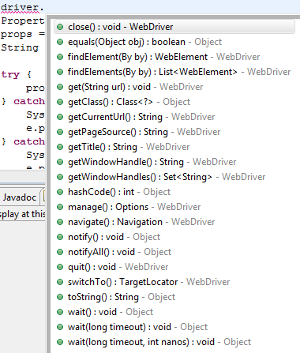
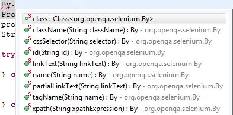
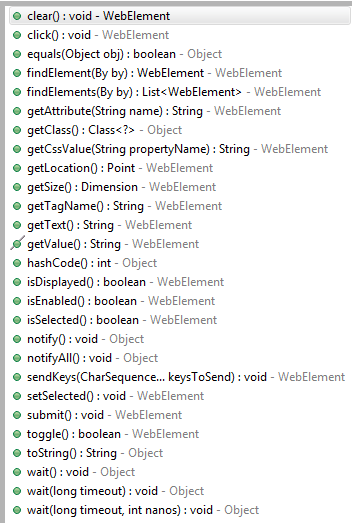

Migrating from Selenium-RC to WebDriver

  

A Java Self Study Guide

  

Alan Richardson

  

[www.eviltester.com](http://www.eviltester.com/)

[www.compendiumdev.co.uk](http://www.compendiumdev.co.uk/)

#  1 Introduction 

## About this book

This book was written in 2011 and updated in 2014 to support migration from Selenium 1 to Selenium 2.

You can find more information about Selenium 1 in my book Selenium Simplified (open sourced)

- http://www.compendiumdev.co.uk/selenium/

This book was the text for a workshop I conducted on Migrating from Selenium 1 to Selenium 2.

It was supported by a subversion repo.

For the purposes of open sourcing this text and releasing it in June 2018 I have:

- only edited the text of this book to allow it to generate a pdf
- amended the source code to be slightly better formatted by using `~~~~~~~~` blocks
- added the images that were missing from the original doc
- line wrapped the source code so it doesn't fall off the page when generated as a pdf
- I have deleted the svn repo but in the repo for this book you will find:
    - `\initial-code`. - revision 2 of the svn repo
    - `\migrated-code` - final revision of the svn repo after making the changes in this book 

This was my first attempt at creating a 'case study book'. My most recent case study book is:

- [Automating and Testing a REST API](https://www.compendiumdev.co.uk/page/tracksrestapibook)

The current text you are reading has the issue that source code snippets were copy and pasted into the text making the entire process more labour intensive and error-prone. I didn't spend much time formatting them, and there are many inline code snippets that would benefit from some `code formatting` but I haven't spent the time doing that.

I'm releasing this as a 'historical' artifact. It might still have some value - not in terms of migrating from Selenium1 to Selenium 2 (or 3 at the time of writing). But more in terms of the thought processes used to migrate and refactor code.

You might also gain some value from the page object refactorings that I have used.

I no longer use Ant, I try to avoid annotations when I code so I avoid the Page object annotations from Selenium.

The code will not build as I have not added the dependencies into the repo. I recommend reading the code, rather than running the code - it is very old after all.

I haven't read the text to review its accuracy, I've left the contents pretty much as they were when I last committed in 2014.

- I suspect that most of the URLs listed will not work.

This was originally written to release as a [leanpub](http://leanpub.com) document, so might act as an example of a book formatted for that platform. This current pdf was not generated through leanpub it was generated using:

- https://github.com/eviltester/pandocifier
- https://pandoc.org/

> **No warranty provided - treat as a historical artificat.**
> Alan Richardson , June 2018

##  1.1 Why Migrate? 

You have a set of tests in Selenium 1.0 and you are happy so why Migrate? 

Well Selenium 2.0 offers the WebDriver API which is a much better API for programming against. 

Selenium 2.0 is the version that will be maintained. If you haven't already encountered issues by upgrading your Firefox version to 4 then when you do upgrade to 4 you might have to amend the Selenium 0.9 or 1.x jars to use FireFox 4. 

Now might not be the right time for you to commit to migration. But it may be the perfect opportunity to learn the differences between Selenium 1.0 and Selenium 2.0 and investigate some migration strategies open to you. This Book aims to help you do that. 

##  1.2 Key Skills You need to learn to code in Selenium 2.0 

Learn to read Java: 

  * you need to read the Selenium 2.0 source code 

Learn to read forums 

  * you need to see how other people have used the code and the questions they have 

Connect to the IM Server 

  * Here you can get real time feedback on your questions 

Learn to code Java 

  * When you read the Selenium source code, the better your Java programming skills the better you will understand some of the more exotic classes without needing to follow tutorials. 
  * e.g. PageObjectFactory 

Use StackOverflow 

  * If your question has been asked and answered on StackOverflow then the answer may well make more sense than the snippets seen in the Forums where the replies can be rather terse 

##  1.3 Caveats 

This migration used Firefox 4, IE8, Selenium 2.0b3. Tests were executed on Windows 7, Windows XP and Linux (using saucelabs.com). 

You may encounter different issues during the migration with later versions of Selenium and with different browsers and operating systems. 

We have taken some steps to support Firefox 3.6 and IE9 

##  1.4 How to use this text 

This text is the self study guide component of the "Migrate to Selenium 2.0" Training programme. 

#  2 Overview of Selenium 1.0 Idioms 

Basically a summary of the code that we wrote in Selenium 1.0 

##  2.1 Client 

##  2.2 Server 

##  2.3 Flat API 

##  2.4 JavaScript Waits 

##  2.5 Page Objects 

#  3 Overview of Selenium 2.0 

This section provides a reference style overview of Selenium 2.0 

It concentrates on the Selenium 2.0 functionality you need to know to migrate the example tests in the code base. 

It does not aim to provide a comprehensive overview of Selenium 2.0 and the WebDriver API. It provides just enough to get you started. 

##  3.1 Selenium 1.0 and Selenium 2.0 Differences 

- Selenium 1.0 
- Selenium 2.0 

- Selenium-RC Server 
- Direct Browser Access 

- Flat API 
- Object API 

- Well Documented 
- Forums and Source Code 

- Easy for beginners 
- Better for experienced coders 

##  3.2 WebDriver 

The WebDriver is the main interface to use for your automation. 

[http://code.google.com/p/selenium/source/browse/trunk/java/client/src/org/openqa/selenium/WebDriver.java](http://code.google.com/p/selenium/source/browse/trunk/java/client/src/org/openqa/selenium/WebDriver.java)

All the 'physical' drivers: FirefoxDriver, InternetExplorerDriver etc. implement the WebDriver interface. 

This provides a common set of methods for your automation. 

Figure 3.1 WebDriver Methods 2.0 release candidate 2 

Note the methods which return more complex objects: 

  * manage() 
  * navigate() 
  * switchTo() 

These provide access to additional features such as cookies, alerts, window management etc. 

Explore the API for yourself and although simple, it is very rich in functionality. 

##  3.3 Drivers 

The physical drivers themselves have additional functionality beyond that provided by WebDriver. 

Explore the source code to learn the full scope of each driver and the nuances it provides. 

You access different features of the driver by casting it in different ways. 

e.g. 

  * to access the JavaScript functionality cast the driver to JavaScriptExecutor

    * JavascriptExecutor js = (JavascriptExecutor)driver; 

  * to take screenshots, casts the driver to TakesScreenshot 

###  3.3.1 Firefox Driver 

[http://code.google.com/p/selenium/source/browse/trunk/java/client/src/org/openqa/selenium/firefox/FirefoxDriver.java](http://code.google.com/p/selenium/source/browse/trunk/java/client/src/org/openqa/selenium/firefox/FirefoxDriver.java)

Firefox driver supports: 

  * the creation of the driver with a profile. This provides an easy way of starting Firefox with Firebug and other tools that you might need to help you with your automation. 
  * taking screenshots 

####  3.3.1.1 FirefoxDriver Profiles 

FirefoxProfile is a class well worth reading through. 

[http://code.google.com/p/selenium/source/browse/trunk/java/client/src/org/openqa/selenium/firefox/FirefoxProfile.java](http://code.google.com/p/selenium/source/browse/trunk/java/client/src/org/openqa/selenium/firefox/FirefoxProfile.java)

From the code you can see that using a FirefoxProfile you can: 

  * add extensions 
  * set preferences 
  * set proxy settings 
  * change the SSL certificate settings 
  * etc. 

An essential class for configuring Firefox as you require it for your testing. We cover this in more depth in the Worked example section. 

###  3.3.2 Internet Explorer Driver 

[http://code.google.com/p/selenium/source/browse/trunk/java/client/src/org/openqa/selenium/ie/InternetExplorerDriver.java](http://code.google.com/p/selenium/source/browse/trunk/java/client/src/org/openqa/selenium/ie/InternetExplorerDriver.java)

At the time of writing the Internet Explorer Driver doesn't let you do much more than start the browser session, although it does support TakesScreenshot. 

Over time this will change so read the source code, or pay attention to the code completion against the driver to see what features get added to the driver. 

##  3.4 Page Navigation 

Selenium 2.0 places no constraints on domains. With Selenium 1.0 each session was constrained to a single base domain, so if your application redirected you to a different domain, there was no way for you to automate that. 

With Selenium 2.0 no such contraints exist. You control the browser so can jump around between domains as you need to. 

###  3.4.1 With Selenium 1.0 

Selenium allows us to open pages with: 
    

~~~~~~~~    
    selenium.open(aURL);
~~~~~~~~    

Where the URL is a relative url to the base URL passed through to Selenium when we start the Selenium session. 

e.g. 
    
~~~~~~~~    
    selenium.open("Showcase.html");
~~~~~~~~    

###  3.4.2 With WebDriver 

WebDriver automates the browser directly so has no concept of a base URL. 

You can either: 

  * use the WebDriver object and the .get method

    * get(String anAbsoluteURL) 

  * use the navigate() method to return a Navigation object and the methods from this 

The Navigation object has two methods to go directly to a url: 

~~~~~~~~
  * to(String aURL) 
  * to(URL aUrl) 
~~~~~~~~

e.g. 

You can also simulate the back and forward browser buttons using the Navigation object with: 

~~~~~~~~
  * .back() 
  * .forward() 
~~~~~~~~

####  3.4.2.1 Examples 

~~~~~~~~
  * driver.get("http://www.eviltester.com"); 
  * driver.navigate.to("http://www.eviltester.com"); 
  * driver.navigate.to(new URL("http://www.eviltester.com")); 
~~~~~~~~

##  3.5 Locator Strategies 

WebDriver uses a lot of objects to make the API simple to store in your head, and organise. 

So in Selenium 1.0 there were a lot of methods for 'doing stuff to the page'. Now, you find a WebElement on the page and use the methods that it exposes to automate the web application. 

###  3.5.1 Finding 

The two basic methods for locating a WebElement are: 

  * FindElement

    * which locates a single WebElement 

  * FindElements

    * which locates multiple WebElement(s) and returns them in a collection 

###  3.5.2 By 

The FindElement(s) methods take a By object as an argument. The By class implements the locator strategies we can use. 

Figure 3.2 By Methods 

The method names are simple enough to understand what they do so: 

  * By.xpath

    * allows you to find an element By using an XPATH 

  * By.cssSelector

    * allows you to find an element By using a CSS selector 

  * etc. 

###  3.5.3 Chaining 

WebDriver allows us to chain location strategies in two ways: 

  * findElement(By(x)).findElement(By(y))

    * by having follow on findElement statements as a WebElement supports the findElement(s) methods 

  * findElement(new ByChained(By(x),By(y)))

    * by chaining the location strategies together 

When chaining we can mix location strategies so could do: 

  * findElement(By.xpath("//div[@id='bob']")).findElement(By.linkText("dobbs")) 

We can make this as flexible as we need to for test readabilitya nd maintainability. 

##  3.6 WebElement 

If you only paid attention to two classes in WebDriver they would be WebDriver itself, and WebElement. 

  * WebDriver represents the browser. 
  * WebElement represents everything on the page. Every snippet of HTML. Every div. Every anchor. Every... well, HTML Element. 

[http://code.google.com/p/selenium/source/browse/trunk/java/client/src/org/openqa/selenium/WebElement.java](http://code.google.com/p/selenium/source/browse/trunk/java/client/src/org/openqa/selenium/WebElement.java)

Since the concept of a WebElement is pretty generic, the class will expose methods that will not be appropriate for some of the elements it represents. 

So don't expect to be able to .submit something that is not in a form. Or .toggle a radio button. 

Figure 3.3 WebElement Methods 

Again the method names are self explanatory. 

Note that a WebElement can go 'stale' if the DOM changes, so on each method call the WebElement checks if it is still in the DOM, in the same place, so you have to consider this in your automation. A StaleElementReferenceException will be thrown if this happens. 

Note the methods which return more complex objects: 

  * getSize() 
  * getLocation() 

allow you access to more attributes of the web element, you might need this for more complicated Ajax waits. 

###  3.6.1 RadioButtons and Checkboxes 

Some of the methods apply to certain types of Elements. I have pulled out the following few, simply because we use them in the Worked Example section. 

  * .isSelected() 
  * .setSelected 
  * .toggle() 

###  3.6.2 Rendered Web Element 

RenderedWebElement was deprecated in Selenium 2.0 release candidate 2. 

All the RenderedWebElement functionality moved into WebElement. 

So if you were used to casting a WebElement into a RenderedWebElement to access the css style properties and sizes etc. You no longer have to. 

##  3.7 Javascript 

Selenium 1.0 had specific methods to allow us to mess with JavaScript. 

WebDriver provides a whole class. We cast the driver to a JavascriptExecutor to access this functionallity. 

A whole class which supports 2 methods: 

  * isJavascriptEnabled() to allow us to check 
  * executeScript to do some Javascript goodness 

e.g. 

~~~~~~~~    
    JavascriptExecutor js = (JavascriptExecutor)driver; 
    return (Boolean)js.executeScript("return 1!=-1;");
~~~~~~~~    

executeScript converts the return from the execution into an appropriate Java object. 

##  3.8 Alerts, Frames and Windows 

WebDriver has the concept of a TargetLocator object, which is returned from the switchTo() method. 

Using this it is possible to gain access to: 

  * current element in focus

    * driver.switchTo().activeElement() 

  * an Alert

    * driver.switchTo().alert() 

  * a frame, which is a WebDriver object returned by

    * driver.switchTo().frame(...) 

  * a window, which is a WebDriver object returned by

    * driver.switchTo().window(String nameOrHandle) 

In this migration we only need to deal with Alerts 

###  3.8.1 JavaScript Alerts 

In Selenium 1.0 we are used to checking if an alert is present and if so, evaluating its content. 
    
~~~~~~~~    
    boolean alert = selenium.isAlertPresent();
    if(alert){
       ok_so_far = selenium.getAlert().contentEquals("Stop poking me!");
    }
~~~~~~~~    

In Selenium 1.0 JavaScript alerts are 'handled' and so not visible during automated execution. 

In Selenium 2.0 the JavaScripts are shown. Therefore we have to write code to switch to the Alert, as opposed to the page and then act on the Alert. 
    
~~~~~~~~    
    Alert anAlert = driver.switchTo().alert()
    
    assertTrue(anAlert.getText().contentEquals("Stop poking me!"));

    driver.switchTo().alert().accept();
~~~~~~~~    

The alert() method returns an Alert object. 

  * accept

    * press the OK button on the Alert 

  * dismiss

    * press the Cancel button on the Alert 

  * getText

    * returns the text in the Alert 

  * sendKeys

    * trigger keypresses when the Alert is displayed 

If alert is not present then we will get a null pointer exception when trying to access it from switchTo, so if we wanted to, we could wrap this in an ExpectedCondition wait and check for the existence of an alert. 

##  3.9 WebDriverBackedSelenium 

[http://code.google.com/p/selenium/source/browse/trunk/java/client/src/org/openqa/selenium/WebDriverBackedSelenium.java](http://code.google.com/p/selenium/source/browse/trunk/java/client/src/org/openqa/selenium/WebDriverBackedSelenium.java)

An emulation layer for the Selenium interface. 

As you try and use it, and as you dive into the code for it, you will see that it is not a full emulation layer - primarily regarding the javascript methods of Selenium 1.0 (but if you were using those, you probably know how to get yourself out of any problematic situations). 

It does a pretty good job of emulating most of the other functions. And the source code for this provides some interesting insight into how you might combine WebDriver and Selenium and Javascript to build automation workarounds. 

You provide a base URL in the constructor for this, but it only really needs this for opening relative URLs. This allows you to drop down to WebDriverBackedSelenium for some targetted automation workarounds in low levels of your Page Object model. 

##  3.10 Page Object Factory 

###  3.10.1 Selenium 1.0 Style 

With Selenium 1.0, your Page Objects would take the form of a class, with methods that "do stuff" to the page. This allows you to hide the Selenium calls in a layer of abstraction. 

###  3.10.2 Selenium 2.0 Style 

####  3.10.2.1 Using New Classes 

The Selenium 2.0 codebase offers some new Classes and annotations to help build Page Objects. The main ones are described below. 

  * @FindBy

    * an annotation which we apply to WebElements to define how the WebElement can be found on the page 

  * @CacheLookup

    * an additional annotation which defines the WebElement as one which always has the same instance in the DOM, so once found, can be reused in the page object. Without this, the WebElement is 're-found' each time it is accessed. 

  * How

    * an Enum used as a parameter in the FindBy to define how to locate it 

  * ElementLocatorFactory

    * an Interface for a class which implements an ElementLocator from a createLocator method 
    * AjaxElementLocatorFactory

      * a factory class which returns an AjaxElementLocator as the ElementLocator, you can define a timeout to wait for the element to appear 

    * DefaultElementLocatorFactory

      * default implementation of a Locator Factory which returns a DefaultElementLocator 

    * DefaultFieldDecorator

      * creates a proxy to each of the annotated WebElements. You cannot cast a WebElement initialised using a PageFactory.initElements to a RenderedWebElement so if you want to use RenderedWebElement methods then you need to declare the element as a RenderedWebElement 

  * ElementLocator

    * an interface for a class which implements a findElement method returning a WebElement 
    * DefaultElementLocator 
    * AjaxElementLocator 

  * PageFactory

    * contains the static initElements methods used to instantiate the annotated WebElement fields 

You can find the classes in the source code in: 

  * org.openqa.selenium.support 
  * org.openqa.selenium.support.pagefactory 
  * org.openqa.selenium.support.pagefactory.internal 

####  3.10.2.2 Basic Usage 

To use these we: 

  * Annotate WebElement(s) or RenderedWebElement(s) with @FindBy

    * define the strategy for How to locate the element using the @FindBy parameters 
    * e.g. @FindBy(how = How.XPATH, using="//table[@id='gwt-debug-cwFlexTable']/tbody") 

  * Initialise the annotated WebElement(s) in the Page Object constructor using an ElementLocatorFactory and the PageFactory 
    
~~~~~~~~    
    public FlexTablePanel(WebDriver driver) {
      ElementLocatorFactory finder = new AjaxElementLocatorFactory(driver,10);
      PageFactory.initElements(finder,this);
      this.driver = driver;
    }
~~~~~~~~    

####  3.10.2.3 @FindBy and How 

Create Fields to represent the WebElements that your Page Object model uses e.g. buttons, text fields, etc. 
    
~~~~~~~~    
    WebElement submitButton;
~~~~~~~~    

You cannot cast a WebElement instantiated with the PageFactory to a RenderedWebElement so if you want to use the RenderedWebElement methods then you need to declare the field as a RenderedWebElement. 

Annotate the WebElement with @FindBy. And use the parameters to declare the mechanism for how to find the WebElement on the page. 
    
~~~~~~~~    
    @FindBy(how = How.XPATH, using="//div[@id='submit']")
    WebElement submitButton;
~~~~~~~~    

The above would find an element on the page using the xpath "//div[@id='submit']" and assign it to the submitButton field. 

This is equivalent to: 
    
~~~~~~~~    
    submitButton = driver.findElement(By.xpath("//div[@id='submit']"));
~~~~~~~~    

At the time of writing in version 2.0b3, the How Enum has the following values: 

  * CLASS_NAME 
  * CSS 
  * ID 
  * ID_OR_NAME 
  * LINK_TEXT 
  * NAME 
  * PARTIAL_LINK_TEXT 
  * TAG_NAME 
  * XPATH 

The value for each of these can be defined in the "using" parameter e.g.: 

~~~~~~~~
  * @FindBy(how = How.XPATH, using="//div[@id='submit']") 
  * @FindBy(how = How.ID, using="submit") 
~~~~~~~~

Or you can be more explicit in the @FindBy definition and define the location strategy and locator in one statement: 

~~~~~~~~
  * @FindBy(xpath="//div[@id='submit']") 
  * @FindBy(id="submit") 
~~~~~~~~

To support the above style, the FindBy interface has the following parameters: 

  * id 
  * name 
  * className 
  * css 
  * tagName 
  * linkText 
  * partialLinkText 
  * xpath 

####  3.10.2.4 Chaining @FindBy 

You can 'chain' @FindBy in the same what that you can 'chain' findElement statements. 

So: 
    
~~~~~~~~    
    WebElement submitLink =
    				driver.findElement(By.className("buttons")).
    					   findElement(By.linkText("submit"));
~~~~~~~~    

could become: 
    
~~~~~~~~    
    @FindBy({@FindBy(className="buttons"), @FindBy(linkText="submit")})
    WebElement submitLink;
~~~~~~~~    

####  3.10.2.5 PageFactory and ElementLocatorFactory 

The annotations do not do anything on their own. 

The PageFactory.initElements method has to be called for a page object in order to assign a proxy finder for each of the annotated WebElement(s) 

The simplest form calls the PageFactory.initElements with the Object containing the @FindBy annotations. In the example below I am calling the initElements method in the Page Object constructor: 
    
~~~~~~~~    
    public MyPageObject(WebDriver driver) {
    	PageFactory.initElements(this);
    	this.driver = driver;
    }
~~~~~~~~    

The above would use the DefaultElementLocatorFactory and associated DefaultElementLocator to create proxies for all annotated WebDriver fields. 

The DefaultElementLocator implements a findElement that uses a By object based on the annotation definition and honours the caching annotation @CacheLookup. This can speed up access to the locator or result in stale object references if the WebElement is not cacheable. 

####  AjaxElementLocator and AjaxElementLocatorFactory 

One element locator supplied in Selenium 2.0 is the AjaxElementLocator. Designed for use with Dynamic DOM elements created by JavaScript. These may not be present on the page when you try to find them, the application may still be in the process of creating them. So the AjaxElementLocator allows you to define a TimeOut to wait until the WebElement is present in the DOM. 

You can create your own ElementLocator, based on the AjaxElementLocator and override the isElementUsable method to implement your applications definition of usable, e.g. it may have to be displayed, or be a certain height, or assigned a specific css class etc. etc. 

In the example below, I use the AjaxElementLocatorFactory with a timeout out of 10 seconds to wait for each element. 
    
~~~~~~~~    
    public MyPageObject(WebDriver driver) {
      ElementLocatorFactory finder = new AjaxElementLocatorFactory(driver,10);
      PageFactory.initElements(finder,this);
      this.driver = driver;
    }
~~~~~~~~    
    

####  3.10.2.6 Custom Locator Factories 

If you wanted to create your own locators: 

  * possibly to wait for the element to be displayed 
  * possibly to have more control over the location strategies 

Then you create both a locator and a factory. 

I have done this when I wanted to use the annotation approach to keep my Page Object classes simple, but I wanted to create them for components to they needed to be relative to some other component. 

When I did this I created a factory that took an xpath my component would be relative to, and in the findElement method for my locator class I simply tagged the annotation locator on to the relative xpath in the factory. 

This is a more advanced usage of factories than I intend to present in this migration guide. 

You can find an exxample of a custom locator in this stackoverflow.com answer by Zloi Adun: 

  * [http://stackoverflow.com/questions/3981498/selenium-page-object-reuse](http://stackoverflow.com/questions/3981498/selenium-page-object-reuse)

###  3.10.3 Field Access Levels 

Because PageFactory approach to Page Objects works at a field level. We have some choices open to us; 

  * do we make our fields public and allow access from within tests 
  * do we wrap our fields in Page Object Methods 

I use the PageFactory approach to build Page Objects quickly. Since I'm doing it quickly I start by making my fields publicly accessible. 

e.g. 

~~~~~~~~    
    @FindBy(id="submit")
    Public WebElement submitButton;
~~~~~~~~    

Then in my test I can say 
    
~~~~~~~~    
    submitButton.click();
~~~~~~~~    

I do this for expediency. And then I refactor later to have more contextual methods at the Page Object. With the annotated fields becoming private to the Page Object. 

You have to think about what works best for you. 

To some extent you have abstracted away the location details so your test is less vulnerable to changes in page structure than if you use findElement().click() style code directly in your test. 

But by making the fields public you have tightly coupled the test to the physical element level of your page. You might want to introduce a more domain specific layer on top of this physical access layer. 

##  3.11 WebDriverWait 

The Selenium 2 code base offers a WebDriverWait class to allow the the Java developer to wait until some condition manifests before continuing with the test. This can be used in two ways: 

  * An adhoc Wait 
  * An architectural decision to build a contextual framework 

WebDriverWait takes an object which implements the ExpectedCondition interface as a parameter. 

A WebDriverWait 'swallows' NotFoundExceptions. 

To Implement the ExpectedCondition interface have to override an 'apply' method. 

Apply can return an Object or Boolean. If it returns an Object then null is treated as false and not null treated as true and ends the wait loop. 

  * ExpectedCondition implements apply 
  * Apply returns null or Boolean 
  * wait.until stops when !null or true 

###  3.11.1 WebDriverWait as an Adhoc Wait 
    
~~~~~~~~    
  new WebDriverWait(driver, 10){}
  .until(new ExpectedCondition(){
    @Override
    public Boolean apply(WebDriver driver) {
               return driver.getTitle().
                   startsWith(TITLE_OF_PAGE_STARTS_WITH_THIS);
          }});
~~~~~~~~
    

Here we have created a new WebDriverWait, which times out in 10 seconds if the Expected Condition is not met. 

The ExpectedCondition is defined as an anonymous inner class where we have overriden the apply method to implement the check for the expected condition. 

You can use it as an adhoc wait to create simple checks using the driver. 

If you want to use anything more complicated then you have to make an architectural decision and build the wait into your abstraction layer. 

###  3.11.2 WebDriverWait as an Architectural Decision as a local support class 

We can choose to make the wait local to the page and create the classess within the page object itself. But I'm not going to cover that here. 

See blog post for this... 

###  3.11.3 WebDriverWait as an Architectural Decision to build an abstraction layer 
    
~~~~~~~~
    WebDriverWait wait = new WebDriverWait(driver, 20);
    MyExpectedCondition conditionMet = new MyExpectedCondition();
    wait.until(conditionMet);
~~~~~~~~

An example ExpectedCondition, which implements the 'count' checking as shown in the previous Wait would look like: 
    
~~~~~~~~
    import org.openqa.selenium.WebDriver;
    import org.openqa.selenium.support.ui.ExpectedCondition;
    
    public class MyExpectedCondition implements ExpectedCondition{
    
    	int count =0;
    	
    	@Override
    	public Boolean apply(WebDriver driver) {

    		if(count==10)
    			return true;
    		
    		count++;
    		return false;
    	}

    }
~~~~~~~~    

###  3.11.4 Advantages to WebDriverWait 

  * Because WebDriverWait 'swallows' NotFoundExceptions, when you use driver commands in the apply method you do not need a try catch block. 
  * The calling code looks a lot cleaner 
  * You have a cleaner Object hierarchy and can reuse the ExpectedConditions 
  * Your waits can return Objects

    * so I could return a WebElement in my wait e.g. wait.until(condition).click() 

###  3.11.5 Disadvantages to WebDriverWait 

  * You need to write more code 
  * You need to think a little more about your abstraction layer (although this is probably a positive) 

###  3.11.6 Summary 

  * Wait is good for adhoc waits, when building tests or experimenting with automation 
  * WebDriverWait is better for building robust abstraction layers and wrapping WebDriver calls 

#  4 Migration Strategies 

This chapter provides an overview of the main migration strategies that you are likely to use. If you think of others then please let the author of this text know. 

##  4.1 Introduction 

When approaching the migration of a set of tests from Selenium 1.0 I think there are 3 main approaches that people will think of: 

  * Drop in replacement for Selenium 1.0 
  * Selenium Emulation 
  * Conversion to WebDriver 

Given the advertising behind Selenium 2.0 regarding backwards compatibility, and simply in terms of degrees of non-invasiveness I have listed them in the order I think that most people will try. 

Of course, that depends on your automation setup. 

You may also find that your automated setup presents you with some challenges that interfere with a migration process and you may have to remove some of those before you start. 

For example, if you have been running your tests in parallel with multiple Selenium sessions running on the same server, you probably want to remove this capability while migrating. 

Ideally you want as simple as possible a Selenium setup when you migrate so that you remove issues related to the actual automation code, before tackling the automation architecture. 

However, if the architecture you have e.g. tests running in parallel on multiple machines. Is vital to your automation success then do not dive straight into a migration. 

First do an evaluation of Selenium 2.0 to make sure that you can tailor it architecturally to your automation needs. This can probably be done without knowing much about WebDriver itself. 

Do not go through the whole process of migrating all your tests, only to discover that you do not know how to solve some of the architectural constraints you have placed on yourself. 

If Selenium 1.0 is working for you. And you can not get a Selenium 2.0 technical setup working. Then it may not be time for you to migrate yet. 

##  4.2 Drop in replacement for Selenium 1.0 

The Selenium 2.0 jar can operate the same way as the Selenium 1.0 server. So by starting it with: 

java -jar selenium2rc.jar 

You should be able to connect with your existing code and client. If your client doesn't work, try upgrading to the new Selenium 2.0 clients. 

If this works then it is the simplest way of upgrading. 

You won't have migrated over to any of the WebDriver nuances, but you immediately have the capability of incorporating the WebDriver nuances and styles into your automation code over time. 

##  4.3 Selenium Emulation 

Selenium 2.0 provides a WebDriverBackedSelenium class to allow you to instantiate a DefaultSelenium object that uses WebDriver instead of the Selenium server. 

If this works for your tests then you can move away from the Selenium server approach and start using the WebDriver concepts. If you want to retain the Selenium server benefits of running tests on other machines then you can move over to the RemoteWebDriver instead of a local WebDriver. 

##  4.4 Conversion 

A controlled migration over to WebDriver concepts and nuances. 

  * Migrate to WebDriver from highest level of abstraction 
  * Promote driver to same level as Selenium

    * Push Selenium Emulation ever lower in the abstraction stack 
    * Finish when Selenium Emulation no longer used 
    * Aim to keep all tests running at all times 

In this process the WebDriverBackedSelenium is likely to be used to enable you to employ workarounds in your automation rather than as a main part of your automation strategy. 

#  5 A Worked Example: Logistics 

##  5.1 Setup your environment 

To follow along with this tutorial. You will need to install some tools. 

* A Java IDE, because you will be writing Java code and running tests from the IDE 
    * Eclipse ([http://www.eclipse.org/](http://www.eclipse.org/)) 
    * NetBeans ([http://netbeans.org](http://netbeans.org)) 
    * IntelliJ IDEA ([http://www.jetbrains.com/idea/](http://www.jetbrains.com/idea/)) 

* Subversion client either GUI or command line tools
    * You will need to checkout the source code for the workshop and (optionally) the sourcecode for Selenium. 
    * [http://subversion.apache.org/](http://subversion.apache.org/)
    * On Windows I use [http://tortoisesvn.tigris.org/](http://tortoisesvn.tigris.org/)
    * Or I install a full subversion setup via the visual svn server [http://www.visualsvn.com/server/](http://www.visualsvn.com/server/)

##  5.2 Download the workshop sourcecode 

Create a directory to store everything. 

* `...\workspace\advancing`

Checkout the workshop source code at revision 2 into the location on your disk 

`> svn checkout -r 2 http://svn3.xp-dev.com/svn/miration/trunk/`

You can see the command line format above. Or copy the url of the repository into TortoiseSVN [http://svn3.xp-dev.com/svn/migration/trunk/](http://svn3.xp-dev.com/svn/migration/trunk/)

Checkout revision 2 if you want to start at the beginning. You can always update to a different revision at any point. 

Import it into your IDE. 

Run the tests to make sure you have everything configured properly. 

You want the Selenium 1.0 jars in your build path at the start, not selenium-server-standalone-2.0b3.jar 

##  5.3 Run it from Ant 

Install ant ([http://ant.apache.org/](http://ant.apache.org/)) 

You can check that you have it installed by running 

`> ant -version`

There is a simple windows installer available from [http://wiki.apache.org/ant/AntOnWindows](http://wiki.apache.org/ant/AntOnWindows)

##  5.4 Import the Source into your IDE 

###  5.4.1 Eclipse 

###  5.4.2 IntelliJ 

###  5.4.3 NetBeans 

##  5.5 Start the application under test 

`Java -jar SimpleWebServer.jar`

##  5.6 Change the Build Path 

##  5.7 Run The Tests 

`Run CanVisitSiteTests.java`

##  5.8 Using Subversion to workthrough the examples 

'answer'  is referenced during the text 

After Checkout During workshop 

> svn revert * -R

`svn update -r`

During the workshop you can update the code base to the 'sample' answers at any time. 

Before I do that I do a "revert" to remove all my changes. So if you update as you go through (and you probably will) and you want to keep you code then copy it off somewhere. 

You are probably better off making notes than keeping all your code. 

The workshop source starts at revision 2, and this is code using the Selenium 1.0 server. 

#  6 A Worked Example: Overview of the Application Under Test 

With java -jar SimpleWebServer.jar running. 

Visit http://localhost/ShowCase.html 

  * GWT 
  * Java compiled to JavaScript 
  * Lots of JavaScript 
  * Event Triggering Required 
  * JavaScript Sync Issues 
  * Small app, Good Challenge 

Screenshots illustrate Lack of IDs, 'Ajax' updates 

Explain moving sidebars up and down 

mention in /demoSites 

mention the SimpleWebServer.jar 

#  7 A Worked Example Overview of the Selenium 1.0 Tests 

Overview of the Selenium 1.0 version of the project at revision 3 in the repository. 

  * Page Objects 
  * Refactored to remove common code 
  * No thread.sleep used 
  * Sync on 'do' not on 'check' 
  * Positional xpath e.g.`//div/../div`
  * Start Selenium Server from test code 
  * Start lightweight app server from test code 
  * Properties from property file 
  * Selenium 1.0 requires execute Javascript methods to sync e.g. GWTShowcase.java 
  * Some tests we couldn't get working using Selenium 1.0 

##  7.1 CanVisitSiteTests.java 

  * A Single Class "CanVisitSiteTests.java" with all our tests in them 
  * @BeforeClass annotated startSelenium method does a lot of work for us:

    * reads in property file to get our basic configuration items 
    * starts the selenium server in the code for us 
    * if configured to, it starts our local app server

      * we are using the open-source Java Mini Web Server from jibble.com

        * SimpleWebServer.jar 
        * http://www.jibble.org/miniwebserver/ 
        * Embedding it into our source code like this means that we can configure the port it runs against 
        * At only 7.5k (including bundled source) it doesn't add much weight to our build process 

    * We start a Selenium session with the browser and apphost defined in the properties file 

  * All tests start by instantiating a GWTShowcase object and passing in the Selenium session as an argument

    * GWTShowcase is the main class in our Page Object Model and everything else comes from that 
    * Because the tests use a Page Object Model they are pretty readable 

  * Some of the tests do not run as intended

    * useTextInput and useCellTable have not been completed because of some automation issues we encountered with the version of Selenium we are using 

  * We have an @AfterClass annotated method called stopSeleniumServer which closes our session and stops the server 

##  7.2 Page Object Model 

  * 'Partial' page object simply means that it could be better refactored, but we chose to split the GUI into chunks which we can automate. 
  * No Thread.sleep has been used in any of the page objects, it uses a heavy reliance on selenium's waitForCondition e.g. in MenuHeading.java which waits for a JavaScript function to return true with a timeout associated. We also use the JavaScript selenium object in the waitForCondition. 
  * Synchronisation is done on the 'do' methods, i.e. we don't sync when about to do a check, we wait until an action is complete before moving on. This makes for a very robust set of tests but can rule out some test situations, e.g. clicking before a certain state is reached. But since the main outcome of those situations is to break the test scripts we have allowed that. 
  * Relative divs are used which chain back up the path, e.g. Openclose in MenuHeading.java 

##  7.3 Properties File 

We do configuration of the tests from a properties file: 
    
~~~~~~~~
    browser = *iexplore
    useLocalAppServer = yes
    apphost = http://localhost:8088/
    localAppServerPort = 8088
~~~~~~~~

  * use Internet Explorer as the browser 
  * start up the local application server contained in `/demoSite`
  * find the application under test on the url http://localhost:8088 
  * configure the application server to start on port 8088 

##  7.4 Build File 

The Ant build file build.xml has the following targets 

  * clean 

    * (or cleanall) which deletes the bin directory 

  * init 

    * which copies any additional files required for the build into the bin directory 

  * build 

    * which compiles the java code 

  * runtests 

    * which runs the tests 

  * junitreport 

    * which collates the junit reports 

  * test 

    * which runs the tests and collates the junit reports 

Because of dependencies in the build.xml file starting a build from scratch which runs the tests would be triggered by running: 

`> ant clean test`

For general running of the tests we can just type 

`> ant test`

##  7.5 Libraries Referenced 

The Selenium 1.0 version of the project uses the following libraries, these are on the build path and in the `\libs` folder: 

  * junit-4.9b2.jar

    * JUnit used to run the tests 

  * selenium-java-client-driver.jar

    * The java client used to connect to Selenium-RC 

  * selenium-server.jar

    * This is version 0.9 of the Selenium server 

  * SimpleWebServerFull.jar

    * A small open-source web server used for running the GWT application locally when developing the tests 

This is checked in as Revision 2 

#  8 A Worked Example: Use Selenium 2.0 as a Selenium-RC Server 

The first thing we should try for the migration is using Selenium 2.0 as a Selenium-RC server. 

The selenium website advertises the Selenium 2.0 build as a drop in replacement so that will be our first migration strategy. Because if it works out of the box then the rest of our migration to using the WebDriver API should be pretty simple. 

##  8.1 Amend Code to use external Selenium Server 

For our first attempt at automating with Selenium 2.0 we will use our existing tests without amendment. By starting the selenium server at the command line. 

We comment out the server code in CanVisitSiteTests.java 

Hint: If you are using Eclipse then you can use Alt+Shift+S to get the source menu up and then press 'L' to comment out a selected set of lines. 

The test now requires a Selenium server to be running before the test starts. 

This is checked in as Revision 3 

##  8.2 Run with Selenium 1.0 Server 

This demonstrates that the tests do run against Selenium 1.0 server. 

So in from one command line start the selenium server from the /libs directory: 

~~~~~~~~
> java -jar selenium-server.jar 
~~~~~~~~

From another command line run the tests using ant from the main project directory. 

~~~~~~~~
> ant test 
~~~~~~~~

Alternatively you could run the tests from the IDE by running CanVisitSiteTests.java as a JUnit set of tests. 

Hint: on windows I use Console (http://sourceforge.net/projects/console/) to have multiple command line with a single window 

##  8.3 Run with Selenium 2.0 Server 

Remove Selenium 1.0 server library from the build path: 

  * selenium-server.jar 

Add Selenium 2.0 libraries to the build path: 

  * selenium-server-standalone-2.0b3.jar 

I downloaded the new jar from the Selenium site (http://seleniumhq.org/download/) 

Run selenium 2.0 as the server 

~~~~~~~~
> java -jar selenium-server-standalone-2.0b3.jar 
~~~~~~~~

Run the tests. 

> ant tests  
or run from the IDE 

If that didn't work (and it didn't for me on Windows 7 with IE 9), try: 

  * changing the browser *firefox, (didn't work for me on FF 3.6) 
  * *googlechrome (tests run, but they don't pass for me version 11), 
  * - try starting the server in -singleWindow mode to make it easier to see 
  * The tests run, but they don't pass. 

Your mileage around what will work here may vary. I finished with *googlechrome in the code as the browser and started the server as 

~~~~~~~~
> java -jar selenium-server-standalone-2.0b3.jar -singleWindow 
~~~~~~~~

I could spend time investigating why it isn't working with the new server out the box, but it was only ever going to be a stop gap solution. I want to migrate over to Selenium 2.0 and use the WebDriver API so this was just a check to see if I could stop here and have a working project - but I can't so I need to continue with the migration before I count the migration as done. 

You don't actually need the selenium client library any more so remove that from your build path, all the client code you need is in the selenium-server-standalone-2.0b3.jar 

  * selenium-java-client-driver.jar 

This is checked in as Revision 4 

#  9 A Worked Example: Configure Selenium 2.0 

I downloaded the selenium sources jar from the Selenium site they are contained in the Selenium Client Drivers .zip download. 

The best documentation for Selenium 2 is the source code. 

So I took selenium-java-2.0b3-srcs.jar from the zip and added it to the libs folder. 

This way my codebase has fewer libs in it to manage because the main Selenium jar I use is the all-in-one jar it just doesn't have the source-in-it 

This is checked in as Revision 5 

##  9.1 Associate Selenium Source Code 

The selenium source is included in the checkout in the selenium-java-2.0b3-srcs.jar 

Although we are using the all-in-one build for the server, the `...srcs.jar` is included in the 'other' download for Selenium. But I have extracted it into the repo to make things easy. 

Then I have to link the source code in the workshop to the Selenium source code. 

In IDE link the workshop code to Selenium code in `libs\selenium-java-2.0b3-srcs.jar`

##  9.2 Viewing the full Selenium 2.0 Source Code 

If you want to you can checkout the full Selenium source code. 

You could import the Selenium java code into Eclipse to make it easy to browse the Selenium code. 

If you want you could do an 

`> Svn checkout http://selenium.googlecode.com/svn/trunk/java/`

Or browse the Selenium 2.0 code online 

http://code.google.com/p/selenium/source/browse/#svn/trunk 

#  10 A Worked Example: WebDriverBackedSelenium 

Our next step in the migration is to try the Selenium Emulation provided by WebDriverBackedSelenium 

To use this we instantiate a WebDriver and wrap that driver in a WebDriverBackedSelenium instantiation and use that as a drop in replacement for Selenium in our existing test code. 

##  10.1 What is a Driver? 

A driver is a library that automates the web browser. 

The Selenium 2.0 distribution contains a number of drivers e.g.: 

  * FirefoxDriver 
  * InternetExplorerDriver 
  * ChromeDriver 
  * HTMLUnitDriver 
  * AndroidDriver 
  * IPhoneDriver 

Each driver implements different interfaces to expose its capabilities as all drivers and browser are not at the same level of implemented functionality yet. 

WebDriver is the most generic of the interfaces and contains the most needed commands we will use as it "represents an idealised web browser".

[http://code.google.com/p/selenium/source/browse/trunk/java/client/src/org/openqa/selenium/WebDriver.java](http://code.google.com/p/selenium/source/browse/trunk/java/client/src/org/openqa/selenium/WebDriver.java)

We will initially use the FirefoxDriver in our tests. 

##  10.2 What is WebDriverBackedSelenium? 

Since we want to emulate Selenium we use the WebDriverBackedSelenium object to do this. 

[http://code.google.com/p/selenium/source/browse/trunk/java/client/src/org/openqa/selenium/WebDriverBackedSelenium.java](http://code.google.com/p/selenium/source/browse/trunk/java/client/src/org/openqa/selenium/WebDriverBackedSelenium.java)

WebDriverBackedSelenium wraps the driver and extends the DefaultSelenium object. 

##  10.3 How do we use this? 

  * Comment out the selenium connection and replace with our first WebDriver code. 
  * Then pass the FirefoxDriver to the WebDriverBackedSelenium object which emulates the Selenium interface. 

~~~~~~~~    
    //  selenium = new DefaultSelenium("localhost",
    //                                 4444, 
    //                                 "*iexplore", 
    //                                 "http://localhost/");
    //  selenium.start();
    
    WebDriver driver = new FirefoxDriver();
    selenium = new WebDriverBackedSelenium(driver,"http://localhost/"); 
~~~~~~~~    

Run the test they all fail. We will look at why, after we look at Driver Profiles. 

This is checked in as Revision 6  
I also removed all the commented out SeleniumServer code.

#  11 A Worked Example: Firefox Driver Profiles 

Each driver has different capabilities and it is worth looking through the sourcecode to see what Selenium 2.0 offers for your browser. 

When we look at the Firefox code in Selenium 2.0 we can see a FirefoxProfile object. This can be used to configure Firefox in our tests. 

[http://code.google.com/p/selenium/source/browse/trunk/java/client/src/org/openqa/selenium/firefox/FirefoxProfile.java](http://code.google.com/p/selenium/source/browse/trunk/java/client/src/org/openqa/selenium/firefox/FirefoxProfile.java)

What can we do with the Firefox Driver Profile? 

We can use the FirefoxProfile to: 

  * change the preferences, 
  * add extensions, 
  * change the proxy 

I'm going to cover its basic functionality here because we will use it to help us with our migration. 

During the migration we will have tests that fail, and we need to have the ability to debug those tests during the test execution. Firebug would be a tremendous help for this, but when we start Firefox in our tests we lose our normal plugins and configurations. Hence the profile. So I can pass a profile in which defines loading of Firebug. 

Firebug 1.6.2 (for Firefox 3.6) and 1.7.1 (for Firefox 4) are already in the sourcecode base that you have checked out in the /firefoxExtensions folder. 

I simply add the extension using the .addExtension method. 

I also have to set a preference which Firebug normally sets on first execution, without the .setPreference I will see a dialog for "This is the first time you have used Firebug..." etc. etc. and that will interfere with the tests. 

See also [http://www.eviltester.com/index.php/2011/03/23/selenium-2-makes-automation-debugging-easier/](http://www.eviltester.com/index.php/2011/03/23/selenium-2-makes-automation-debugging-easier/)

~~~~~~~~    
        String extensionPath = "./firefoxExtensions/firebug-1.7.1.xpi";
        FirefoxProfile profile = new FirefoxProfile();
    	profile.setPreference("extensions.firebug.currentVersion", "1.7.1");
    	try {
    		profile.addExtension(new File(extensionPath));
    	} catch (IOException e) {
    		e.printStackTrace();
    	}
~~~~~~~~

Becomes:

~~~~~~~~
    	WebDriver driver = new FirefoxDriver(profile);
    	selenium = new WebDriverBackedSelenium(driver,apphost);
~~~~~~~~

For an extended example on how to configure Firefox through a proxy you can read a blog post on eviltester.com 

[http://www.eviltester.com/index.php/2011/03/23/selenium-2-makes-automation-debugging-easier](http://www.eviltester.com/index.php/2011/03/23/selenium-2-makes-automation-debugging-easier)

Where I simply added proxy setup code e.g. 

~~~~~~~~    
    Proxy localhostProxy = new Proxy();
    localhostProxy.setProxyType(Proxy.ProxyType.MANUAL);
    localhostProxy.setHttpProxy("localhost:8081");
    profile.setProxyPreferences(localhostProxy);
~~~~~~~~

This is checked in as Revision 7 

##  11.1 To support Firefox 4 and Firefox 3.6 

By the time everyone reads this, most of you will have upgraded to Firefox 4, but Revision 9 introduces some changes to support the use of other of versions of firebug if necessary: 

  * firebug-1.7.1.xpi and firebug-1.6.2.xpi are in the firefoxExtensions folder 
  * the code uses firebug-1.7.1 as the default 
  * If you want/must use a different version of Firefox, which supports a different version of firebug (e.g. Firefox 3.6 uses Firebug 1.6.2) then you will have to create a firefox.properties file with the property firebugversion =  you want to use

    * firebugversion=1.6.2 

  * This file is not in subversion therefore if you add it to your ignore list then if you have to revert the codebase it will remain untouched and if you update it will not be affected

    * svn propset svn:ignore firefox.properties . 

You can use this if the version of Firebug is not compatible with your version of Firefox, or you want to use a more recent version of Firebug 

To make these changes I amended the code above to read: 
    
~~~~~~~~    
String firebugVersion = getFirebugVersion();
String extensionPath = "./firefoxExtensions/firebug-" + 
            firebugVersion + ".xpi";
FirefoxProfile profile = new FirefoxProfile();
profile.setPreference("extensions.firebug.currentVersion", 
        firebugVersion);
~~~~~~~~    

and the getFirebugVersion method reads: 

~~~~~~~~    
    	private static String getFirebugVersion() {
    		Properties props;
    		props = new Properties();
    		String propertyFile = "firefox.properties";
    		
    		try {
    			props.load(new FileInputStream("./" + propertyFile));
    		} catch (FileNotFoundException e) {
    			System.out.println("No Properties file found");
    			e.printStackTrace();
    		} catch (IOException e) {
    			System.out.println("Error loading properties file");
    			e.printStackTrace();
    		}
    		 
    		return props.getProperty("firebugversion","1.7.1");
    	}
~~~~~~~~    

You would not normally have to do this in a migration but I have to add it to make this text and supporting code support as many configurations as I can. 

This is checked in as Revision 8 

#  12 A Worked Example: I thought Selenium 2.0 was backwards compatible 

It is, but... an emulation layer has been used, and it isn't fully compatible yet. 

We used "selenium." in our waitForCondition and we are not running selenium as a server we are using webDriverBackedSelenium there fore the selenium object we relied on is no longer present. 

In the selenium emulation layer there is a compoundMutator object which will pull in common parts of Selenium JavaScript into the script sent to the browser, but getTitle has not been emulated in the mutator, so we have to change this line of JavaScript to avoid use of selenium.getTitle 

For more information see [http://www.google.com/codesearch/p?hl=en#2tHw6m3DZzo/trunk/java/client/src/org/openqa/selenium/internal/seleniumemulation/CompoundMutator.java&q=mutator%20isElementPresent&sa=N&cd=2&ct=rc](http://www.google.com/codesearch/p?hl=en#2tHw6m3DZzo/trunk/java/client/src/org/openqa/selenium/internal/seleniumemulation/CompoundMutator.java&q=mutator%20isElementPresent&sa=N&cd=2&ct=rc)

Other parts of our code use selenium.isElementPresent but this is emulated in the mutator so I don't expect the waitForCondition statements using this to have a problem. 

##  12.1 Amend GWTShowcase.java 

In GWTShowcase.java we change 

~~~~~~~~    
selenium.waitForCondition(
      "var waitvalue = selenium.getTitle(); waitvalue.match(/" +
      TITLE_OF_SHOWCASEPAGE_STARTSWITH + "/);", "2000");
~~~~~~~~    

to become: 
    
~~~~~~~~
    selenium.waitForCondition(
      "var waitvalue = document.title; waitvalue.match(/" + 
      TITLE_OF_SHOWCASEPAGE_STARTSWITH + "/);", "2000");
~~~~~~~~    

or optimised to: 

~~~~~~~~    
selenium.waitForCondition(
    "document.title.match(/" + TITLE_OF_SHOWCASEPAGE_STARTSWITH 
    + "/);", "2000");
~~~~~~~~    

Run tests and see additional changes required. 

##  12.2 Amend SideMenu.java 

The same change required in SideMenu.java clickSubMenuItem. 

~~~~~~~~    
  private void clickSubMenuItem(String subMenuText) {
    selenium.click("//div[@class=\"GALD-WOBF\" and .=\"" 
    + subMenuText + "\"]");
    selenium.waitForCondition(
      "var waitvalue = document.title; waitvalue.match(/" + 
          subMenuText + "/);", "2000");
  }
~~~~~~~~    

becomes: 

~~~~~~~~    
  private void clickSubMenuItem(String subMenuText) {
    selenium.click("//div[@class=\"GALD-WOBF\" and .=\"" + 
            subMenuText + "\"]");
    selenium.waitForCondition("document.title.match(/" + 
            subMenuText + "/);", "2000");
  }
~~~~~~~~    

This way we use 'raw' JavaScript instead of relying on the selenium object injected into the DOM by Selenium. 

##  12.3 Amend MenuHeading.java 

  * Menus open, 
  * subMenu items available, but not responsive to clicks immediately 
  * Additional Sync point required on MenuHeading.java 

    * waitForOpen 
    * waitForClosed 

Quick fix... `Thread.sleep(2000);` ... boo hiss 

You will need to add Thread.sleep in MenuHeading.java (Can't just increase the timeout on iselementPresent because the element is present) 
    
~~~~~~~~    
  private void waitForOpen() {
  	try {
  		selenium.waitForCondition(
  			"selenium.isElementPresent('xpath=//div[@class=\"GALD-WOBF\" and .=\"" +
         this.firstMenuItemName + "\"]');",
  			"2000");
  		Thread.sleep(2000);
  	} catch (Exception e) {
  	}		
  }
~~~~~~~~

to

~~~~~~~~
private void waitForClosed() {
	try {
		selenium.waitForCondition(
			"!selenium.isElementPresent('xpath=//div[@class=\"GALD-WOBF\" and .=\"" +
       this.firstMenuItemName + "\"]');",
			"2000");
		Thread.sleep(2000);
	} catch (Exception e) {
	}		
}
~~~~~~~~    

##  12.4 Completed our initial conversion to Selenium 2 

If we had to, we could stop here. At this point all our tests run, and pass, and they use Selenium 2. 

We haven't used any of the Selenium 2 idoms and haven't used any of the WebDriver functionality, but we have managed to migrate our tests over to Selenium 2 using the emulation layer. 

This is checked in as Revision 9 

#  13 A Worked Example: Start migrating to WebDriver 

At the moment the test class CanVisitSiteTest.java instantiates a WebDriver object, but it only uses it to instantiate a selenium emulation object. If we really plan to migrate to WebDriver we need to start using the driver directly. 

We also want to keep the old tests working as we migrate, so we have to keep using the emulation object, but we need to keep the emulation object moving down the abstraction layers until we can wipe it out. This means we need to support both Selenium and WebDriver in the tests and page object models (for a while). 

Our next migration step requires us to pass driver through to the GWTShowcase object instead of selenium. 

We are going to remove selenium from the test and just have WebDriver. The selenium instance will be created in GWTShowcase. 

##  13.1 Summary of steps 

If you want to try it yourself before reading this chapter then here is a summary of the basic steps to take 

  1. Promote WebDriver to the same level as Selenium in CanVisitSiteTests.java 
  2. Remove selenium from CanVisitSiteTests.java 
  3. Pass driver and apphost to the GWTShowcase constructor 
  4. Amend the GWTShowcase constructor to create a WebDriverBackedSelenium object to pass throug to the rest of the Page Object hierarchy 

You already know all the technical details about WebDriver and Selenium to make the changes. 

##  13.2 Start with the Tests and work down 

###  13.2.1 Add WebDriver as a field 

In our test at the moment we have two fields in CanVisitSiteTests.java: 

~~~~~~~~    
    private static Selenium selenium; 
    private static SimpleWebServer appserver;
~~~~~~~~    

We need to promote WebDriver to the same level as Selenium so that it can be used by all our tests. 

So we create a field for WebDriver in CanVisitSiteTests.java 
    
~~~~~~~~    
    private static WebDriver driver;
~~~~~~~~    

In order to make use of this we have to amend startSelenium as follows. To change 
    
~~~~~~~~    
    WebDriver driver = new FirefoxDriver(profile);
~~~~~~~~    

so that it becomes: 
    
~~~~~~~~    
    driver = new FirefoxDriver(profile);
~~~~~~~~    

###  13.2.2 Remove Selenium 

For this particular class, if you scroll through it you will see that selenium is only used to construct the GWTShowcase objects. And since we want to use driver we will just remove Selenium. 

Do this by removing the field (either delete the line or comment it out): 

~~~~~~~~    
    // private static Selenium selenium; 
~~~~~~~~    

Your IDE should now show all the places in the code where Selenium is used, and we can convert those over to WebDriver. 

So we remove the following line in the startSelenium method: 

~~~~~~~~    
    selenium = new WebDriverBackedSelenium(driver,"http://localhost/");
~~~~~~~~    

We need to amend the @AfterClass method to remove selenium.close() change the @AfterClass to read: 

~~~~~~~~    
    @AfterClass
    public static void stopWebDriver(){
    driver.close();
    }
~~~~~~~~    

Then the rest of the errors are the same, where we construct GWTShowcase objects. 

So convert all those lines: 
    
~~~~~~~~    
    GWTShowcase showcase = new GWTShowcase(selenium);
~~~~~~~~    

to 

~~~~~~~~    
    GWTShowcase showcase = new GWTShowcase(driver,apphost);
~~~~~~~~    

These lines will still show as being in error because we haven't converted the GWTShowcase constructor yet. 

We have to amend the calls to the constructor so that we tell GWTShowcase know the base url for the application. 

This requires us to make the apphost variable a field as well. 

Amend: 

~~~~~~~~    
    String apphost = props.getProperty("apphost","http://localhost:8088/");
~~~~~~~~    

to 

~~~~~~~~
    apphost = props.getProperty("apphost","http://localhost:8088/");
~~~~~~~~    

and add a field for apphost 
    
~~~~~~~~    
    private static String apphost;
~~~~~~~~    

Also rename the @BeforeClass method 
    
~~~~~~~~    
    	@BeforeClass
    	public static void startDriver(){
~~~~~~~~    

##  13.3 Change GWTShowcase Constructor 

Either amend the existing GWTShowcase constructor or create a new GWTShowcase constructor automatically 

Amend the GWTShowcase constructor so that it reads as follows: 
    
~~~~~~~~    
    public GWTShowcase(WebDriver driver,String apphost) {
      this.driver = driver;
      this.selenium = new WebDriverBackedSelenium(driver,apphost);
    }
~~~~~~~~    

Here we have just moved the selenium emulation layer, out of the test case class, and into the GWTShowcase class. We will continue to move this line of code as we slowly migrate the tests and page object models away from Selenium. 

Create a field for driver: 
    
~~~~~~~~    
    private WebDriver driver;
~~~~~~~~    

Fix the errors by adding the correct imports: 
    
~~~~~~~~    
    import org.openqa.selenium.WebDriver; 
    import org.openqa.selenium.WebDriverBackedSelenium;
~~~~~~~~    

Remove the previous GWTShowcase(Selenium ...) constructor, if you haven't already. 

We still keep Selenium here for the moment, but we will work on getting rid of this. 

##  13.4 Run the tests 

Running the tests again and they should all still pass. 

##  13.5 Summary 

We will use this basic migration pattern again: 

  * Convert a class to WebDriver 
  * Pass Driver through to the next layer to convert 
  * In the layer we just passed in Driver, create a WebDriverBackedSelenium to pass through to all its child classes 

The above code has been committed as revision 10   
I also made changes to the Firefox properties methods to remove the stack trace reporting as revision 11 

#  14 A Worked Example: Initial Page Object Model Amendments to GWTShowcase 

##  14.1 What we need to do 

Since GWTShowcase is the main Object in the Page Object hierarchy we will start with that. 

We can migrate Selenium out of this class using a two pass process: 

  1. amend all the local methods and check the test still works 
  2. remove selenium from the class and migrate it through to the lower level classes 

I split it into two passes so that I make enough changes to make progress, but not too many that interfere with my ability to see if I have broken anything. 

This chapter will deal with the first pass and involves: 

  * changing the open method to use an adhoc Wait check the driver.getTitle instead of the waitForCondition 
  * amending getPageTitle to use the driver getTitle method instead of the Selenium method 
  * at the end of this pass through Selenium is only retained for passing through to sideMenu 

##  14.2 What you need to know 

To make the changes you need to know: 

  * The adhoc Wait class presented in part one 
  * WebDriver page navigation to open a page as presented in part one 
  * WebDriver has a getTitle method the same as Selenium 

##  14.3 Changes To Make 

###  14.3.1 Open the page with the full url in the open() method 

Open pages with WebDriver with driver.get(...) or driver.navigate.to(...) 

e.g. 

~~~~~~~~    
    public void open() {
      driver.get(apphost + "Showcase.html");
~~~~~~~~    

As an exercise in experimentation you might want to try all the options and see which you prefer. I have chosen to use the .get method on driver. 

###  14.3.2 Change the wait condition in the open() method 

This is the first time we are using a WebDriver wait so I will use the adhoc wait condition explained in part 1. 

I need to remove selenium.waitForCondition 

Need to amend GWTShowcase to use driver and illustrate the wait pattern. 
    
~~~~~~~~    
    // ajax page so wait for it to load
    selenium.waitForCondition("document.title.match(/" + 
    TITLE_OF_SHOWCASEPAGE_STARTSWITH + "/);", "2000");
    assertTrue("wrong title", getPageTitle().startsWith(
        TITLE_OF_SHOWCASEPAGE_STARTSWITH));
~~~~~~~~    

becomes 

~~~~~~~~    
    new Wait("Page Did Not Load"){
      @Override
      public boolean until() { 
        try{
          return driver.getTitle().startsWith(
              TITLE_OF_SHOWCASEPAGE_STARTSWITH);
        }catch(Exception e){
          // ignore not found exceptions 
        };
        return false;
      }
    };
~~~~~~~~    

As an exercise, experiment with the different forms of the Wait code to see which you prefer. 

Note that I also removed the assertTrue as the wait throws an exception on timeout if the title did not match what we expected 

###  14.3.3 change the getPageTitle() method 
    
~~~~~~~~    
    public String getPageTitle(){
      return driver.getTitle();
    }
~~~~~~~~    

Since WebDriver has a getTitle method equivalent to the Selenium getTitle method, I just use driver in place of selenium. 

This code checked in as revision 12 

#  15 A Worked Example: Add Driver to SideMenu 

The vast bulk of our work now is going to be done in the Page Object Models. 

Pushing Selenium ever lower in the abstraction and using driver more. 

##  15.1 What we need to do 

Our second pass through GWTShowcase.java 

  * Inject driver into SideMenu

    * New constructor 
    * Create WebDriverBackedSelenium in SideMenu 

  * Remove selenium from GWTShowcase 

##  15.2 What we need to know 

Everything for this chapter we have already done before. We are simply moving the emulation layer lower in the Page Object hierarchy. 

##  15.3 Changes to make 

###  15.3.1 In GWTShowcase.java 

  * In GWTShowcase.java change the sideMenu method to use driver 

~~~~~~~~    
    public SideMenu sideMenu() {
    return new SideMenu(selenium);
    }
~~~~~~~~    

to ... 
    
~~~~~~~~    
    public SideMenu sideMenu() {
    return new SideMenu(driver,apphost);
    }
~~~~~~~~    

We have to pass apphost through to SideMenu because we are still using the Selenium emulation layer. 

###  15.3.2 In SideMenu.java 

  * Remove the error in GWTShowcase by changing the SideMenu constructor to use driver 
  * Then cut the code out of GWTShowcase.java and move it to SideMenu.java 
    
~~~~~~~~    
    this.driver = driver;
    this.selenium = new WebDriverBackedSelenium(driver,apphost);
~~~~~~~~    

  * Fix the errors in SideMenu.java by creating a field and importing WebDriver 

###  15.3.3 Tidy Both Classes up 

  * Remove all the unneeded imports from GWTShowcase. 

The reason for tidying everything up, is that if we have forgotten something, then removing the declarations will expose it as an error. e.g. if I remove the declaration of Selenium, but try and use it then I'll get errors in the code. 

GWTShowcase is done now, and converted over to WebDriver. 

code checked in as revision 13 

#  16 A Worked Example: Amend SideMenu.java 

##  16.1 What we need to do 

Perform a first pass through SideMenu.java to convert any local methods to use WebDriver, retaining selenium only to pass through to other objects in the Page Object hierarchy. 

##  16.2 What we need to know 

  * Instead of selenium.click:

    * find the element (driver.findElement) and 
    * use the click method on the found WebElement 

  * Use the WebDriverWait rather than adhoc wait to convert waitForCondition 

##  16.3 Changes to make 

###  16.3.1 selenium.click in clickSubMenuItem 

  * Need to amend clickSubMenuItem

    * selenium.click(...) becomes

      * A chained set of object method calls

        * driver.findElement(By.xpath(...)).click() 

    * FindElement -- 

      * how we find a WebElement 
      * By -- the mechanism By which we locate it 
      * Click -- because we need to 

Really just one method we are amending here to start with as all other methods delegate responsibility to some other class. 
    
~~~~~~~~    
    private void clickSubMenuItem(String subMenuText) {
      selenium.click("//div[@class=\"GALD-WOBF\" and .=\"" + 
    subMenuText + "\"]");
      selenium.waitForCondition("document.title.match(/" + 
    subMenuText + "/);", "2000");
    }
~~~~~~~~    

First amend the selenium.click to 
    
~~~~~~~~    
    String subMenuLocator = "//div[@class=\"GALD-WOBF\" and .=\"" + 
    subMenuText + "\"]"; 
    driver.findElement(By.xpath(subMenuLocator)).click();
~~~~~~~~    

changes check in as revision 14 

###  16.3.2 WebDriverWait 

WebDriver has 2 waits. A generic Wait and a WebDriverWait. 

WebDriverWait 'swallows' NotFoundExceptions. So is good to use for findElement and driver calls. 

####  16.3.2.1 What I want to see 

WebDriverWait makes code more readable, so I want to amend the following selenium line into something using WebDriver which is also more readable. 
    
~~~~~~~~    
    selenium.waitForCondition(
      "document.title.match(/" + subMenuText + "/);", "2000");
~~~~~~~~    

I want to see code that looks like this... 
    
~~~~~~~~    
    wait.until(weCanSee.GWTTitleMatches(subMenuText));
~~~~~~~~    

  * weCanSee will be a factory that returns an object implementing ExpectedCondition 
  * wait is a WebDriverWait 

####  16.3.2.2 Create an ExpectedCondition Factory 

I will use a factory to make the code more readable. Each factory method returns an object implementing the ExpectedCondition interface. 

For expediency I create the ExpectedConditionFactory in the page object package although I might choose to refactor that out later. 
    
~~~~~~~~    
import org.openqa.selenium.support.ui.ExpectedCondition;
import com.eviltester.gwtshowcase.pageObjects.
        expectedConditions.JavascriptExpectedCondition;
public class ExpectedConditionFactory {
  public ExpectedCondition GWTTitleMatches(String subMenuText) {
    return new JavascriptExpectedCondition(
      "document.title.match(/" + subMenuText + "/);");
  }
}
~~~~~~~~    

####  16.3.2.3 Create a JavaScriptExpectedCondition 

The JavaScriptExpectedCondition will cast the driver as a JavascriptExecutor which gives me access to the executeScript method. 
    
~~~~~~~~    
    import org.openqa.selenium.JavascriptExecutor;
    import org.openqa.selenium.WebDriver;
    import org.openqa.selenium.support.ui.ExpectedCondition;
...    
    public class JavascriptExpectedCondition implements ExpectedCondition {
...
      private String thisScript;
...
      public JavascriptExpectedCondition(String javaScript) {
        this.thisScript= javaScriptScript;
      }
...
      @Override
      public Boolean apply(WebDriver driver) {
        JavascriptExecutor js = (JavascriptExecutor)driver;
        return (Boolean)js.executeScript(thisScript);
      }
    }
~~~~~~~~    

####  16.3.2.4 Amend SideMenu.java 

So clickSubMenuItem with the wait added looks like this 
    
~~~~~~~~    
    private void clickSubMenuItem(String subMenuText) {
      String subMenuLocator = "//div[@class=\"GALD-WOBF\" and .=\"" + 
          subMenuText + "\"]"; 
      driver.findElement(By.xpath(subMenuLocator)).click();
...
      wait.until(weCanSee.GWTTitleMatches(subMenuText));
    }
~~~~~~~~    

and the constructor like this: 
    
~~~~~~~~    
    private WebDriverWait wait;
    private ExpectedConditionFactory weCanSee;
...
    public SideMenu(WebDriver driver) {
      this.driver= driver;
      this.selenium = new WebDriverBackedSelenium(driver,"http://localhost/");
      widgets = new MenuHeading(selenium,"Widgets", "Checkbox");
      listsAndMenus = new MenuHeading(selenium,"Lists and Menus", "List Box");
      textInput = new MenuHeading(selenium,"Text Input", "Basic Text");
      tables = new MenuHeading(selenium,"Tables", "Grid");
      cellWidgets = new MenuHeading(selenium,"Cell Widgets", "Cell List");
...
      wait = new WebDriverWait(driver, 20); 
      weCanSee = new ExpectedConditionFactory();
    }
~~~~~~~~

This code checked in as revision 15 

##  16.4 Do we even need to wait? 

Additional Exercise: comment out some of the waits and see which are required, and which are not. 

If I comment out the Waits in the tests, some of them are not required... at the moment, when I run it locally. 

But what about remotely? 

Will it run slower? 

I leave the waits in because: 

I know they help remove intermittency by making the test more robust 

The style of coding we used makes the test very readable 

For some sections we may not choose to make the waits explicit because Selenium 2 has implicit waits in the findElement and we can amend the timing of these with: 
    
~~~~~~~~    
    driver.manage().timeouts().implicitlyWait(10, TimeUnit.SECONDS);
~~~~~~~~    

#  17 A Worked Example: BasicButtonPanel 

##  17.1 What we need to do 

  * We can deal with BasicButtonPanel is a single pass as it is at the lowest level of the object hierarchy. 
  * Amend SideMenu.java to construct BasicButtonPanel with WebDriver instead of Selenium. 
  * BasicButtonPanel is constructed in SideMenu and HyperLinksPanel so we need to make changes in both classes. 

##  17.2 What we need to know 

Amend constructors to recieve WebDriver 

How to handle alerts with driver.switchTo.alert() as covered in Part 1 

##  17.3 Changes to make 

  * Start with the SideMenu.java call 
  * Inject WebDriver rather than Selenium 
  * Change HyperLinksPanel at same time

    * Same pattern as before, 
    * split between selenium and driver 

  * Handle Alerts with

    * driver.switchTo().alert()

      * .getText() 
      * .dismiss() 

###  17.3.1 SideMenu.java 

Change the selectWidgetsBasicButton from 

~~~~~~~~    
    public BasicButtonPanel selectWidgetsBasicButton() {
      clickSubMenuItem("Basic Button");
      return new BasicButtonPanel(selenium); 
    }
~~~~~~~~    

to 

~~~~~~~~    
    public BasicButtonPanel selectWidgetsBasicButton() {
      clickSubMenuItem("Basic Button");
      return new BasicButtonPanel(driver); 
    }
~~~~~~~~    

We do not need to pass in the apphost because BasicButtonPanel is on the lowest level of the Object hierarchy so does not use the Selenium emulation layer. 

After we amend the constructor on BasicButtonPanel we can see that we also need to amend the HyperLinksPanel.java because it also creates a BasicButtonPanel. We need to have selenium and WebDriver working in parallel in the HyperLinksPanel. 

So amend the SideMenu.java call to HyperLinksPanel to use driver, we do need to pass in the apphost as we will use the Selenium emulation layer. 
    
~~~~~~~~    
    public HyperLinksPanel selectWidgetsHyperlink() {
      clickSubMenuItem("Hyperlink");
      return new HyperLinksPanel(selenium); 
    }
~~~~~~~~    

becomes 
    
~~~~~~~~    
    public HyperLinksPanel selectWidgetsHyperlink() {
      clickSubMenuItem("Hyperlink");
      return new HyperLinksPanel(driver, apphost); 
    }
~~~~~~~~    

###  17.3.2 HyperLinksPanel.java 

Changing the constructor on BasicButtonPanel impacted HyperLinksPanel.java, such that we need to amend the HyperLinksPanel constructor and copy the driver/selenium code from SideMenu.java into HyperLinksPanel.java 
    
~~~~~~~~    
    private Selenium selenium;
    private WebDriver driver;
...
    public HyperLinksPanel(WebDriver driver, String apphost) {
      this.driver = driver;
      this.selenium = new WebDriverBackedSelenium(driver,apphost);
    }
~~~~~~~~

Then amend the call to BasicButtonPanel to pass in the driver. 

~~~~~~~~    
    public BasicButtonPanel selectBasicButtonLink() {
    selenium.click("gwt-debug-cwHyperlink-com.google.gwt.sample." +
         "showcase.client.content.widgets.CwBasicButton");
    return new BasicButtonPanel(driver);
    }
~~~~~~~~    

###  17.3.3 BasicButtonPanel.java 

####  17.3.3.1 Constructor 

We need to change the constructor on BasicButtonPanel to take a driver 
    
~~~~~~~~    
    private WebDriver driver;
...
    public BasicButtonPanel(WebDriver driver) {
      this.driver = driver;
    }
~~~~~~~~

####  17.3.3.2 isPageTitleCorrect 

An easy fix on isPageTitleCorrect 
    
~~~~~~~~    
    public boolean isPageTitleCorrect() {
    return selenium.getTitle().endsWith("Basic Button");
    }
~~~~~~~~    

becomes 
    
~~~~~~~~    
    public boolean isPageTitleCorrect() {
    return driver.getTitle().endsWith("Basic Button");
    }
~~~~~~~~    

####  17.3.3.3 clickNormalButtonAndExpectPopUp 

The selenium.click is easy, as we have converted this before so: 
    
~~~~~~~~    
    selenium.click("gwt-debug-cwBasicButton-normal");
~~~~~~~~    

becomes a findElement statement but this time using a By.id locator: 
    
~~~~~~~~    
    driver.findElement(By.id("gwt-debug-cwBasicButton-normal"));
~~~~~~~~    

For handling Alerts we will use the switchTo() explained in part 1 

  * I could wrap the driver.switchTo().alert() in a wait ExpectedCondition -- just in case the alert took time to appear. But I'm just going to assume that the alert does exist and check that the text is what we expect 
  * I also have to dismiss the alert. In Selenium 1.0 alerts never appeared so you didn't really have to 'handle' them. 
  * In Selenium 2.0 they do appear so you can get the Text but you also have to 'handle' it by accepting/dismissing it.

    * in this case we 'accept' the Alert by clicking on [OK] 

So the alert functionality becomes 
    
~~~~~~~~    
    Boolean alertTextOK;
    alertTextOK = driver.switchTo().alert().getText().contentEquals(
                      "Stop poking me!");
    driver.switchTo().alert().accept();
    return alertTextOK;
~~~~~~~~    

Code checked in as revision 16 

#  18 A Worked Example: RadioButtonsPanel 

##  18.1 What we need to do 

  * Amend SideMenu.java to construct RadioButtonPanel with WebDriver. 
  * Additionally amend HyperLinksPanel because RadioButtonPanel called from there too. 
  * Fully remove Selenium from HyperLinksPanel in the process as we will no longer need the Selenium emulation layer 

##  18.2 What we need to know 

  * Amend constructors to take WebDriver 
  * WebDriver .findElement and WebElement .click 
  * driver.getTitle 
  * Handling radio buttons using WebElement methods:

    * isSelected 
    * setSelected 

##  18.3 Changes to Make 

  * Start at SideMenu.java

    * Change the constructor 

  * Again need to amend HyperLinksPanel as well 
  * selenium.isChecked becomes...

    * driver.findElement(By...).isSelected(); 

  * selenium.check becomes...

    * driver.findElement(By...).setSelected(); 

###  18.3.1 SideMenu.java 

Change the selectWidgetsRadioButton 
    
~~~~~~~~    
    public RadioButtonsPanel selectWidgetsRadioButton() {
      clickSubMenuItem("Radio Button");
      return new RadioButtonsPanel(selenium); 
    }
~~~~~~~~    

to 
    
~~~~~~~~    
    public RadioButtonsPanel selectWidgetsRadioButton() {
      clickSubMenuItem("Radio Button");
      return new RadioButtonsPanel(driver); 
    }
~~~~~~~~    

After all the changes to HyperLinksPanel to remove selenium, we can remove apphost from the HyperLinksPanel constructor: 
    
~~~~~~~~    
    public HyperLinksPanel selectWidgetsHyperlink() {
      clickSubMenuItem("Hyperlink");
      return new HyperLinksPanel(driver); 
    }
~~~~~~~~    

###  18.3.2 HyperLinksPanel.java 

We can migrate the HyperLinksPanel class completely: 

####  18.3.2.1 isPageTitleCorrect 

isPageTitleCorrect has the normal amendment to use driver.getTitle instead of selenium.getTitle 
    
~~~~~~~~    
    public boolean isPageTitleCorrect() {
      return driver.getTitle().endsWith("Hyperlink");
    }
~~~~~~~~    

####  18.3.2.2 selectRadioButtonLink 

For selectRadioButtonLink we find the element by the ID and click on the WebElement 
    
~~~~~~~~    
    public RadioButtonsPanel selectRadioButtonLink() {
      String elementID =
        "gwt-debug-cwHyperlink-com.google.gwt.sample.showcase." +
        "client.content.widgets.CwRadioButton";
      driver.findElement(By.id(elementID)).click();
      return new RadioButtonsPanel(driver);
    }
~~~~~~~~    
    

####  18.3.2.3 selectBasicButtonLink 

For selectBasicButtonLink we find the element by the ID and click on the WebElement 
    
~~~~~~~~    
    public BasicButtonPanel selectBasicButtonLink() {
      String elementID =
        "gwt-debug-cwHyperlink-com.google.gwt.sample.showcase." +
        "client.content.widgets.CwBasicButton";
      driver.findElement(By.id(elementID)).click();
      return new BasicButtonPanel(driver);
    }
~~~~~~~~    
    

####  18.3.2.4 Constructor 

Then we can remove all references to selenium in this class and amend the constructor and imports. 
    
~~~~~~~~    
    private WebDriver driver;
      public HyperLinksPanel(WebDriver driver) {
      this.driver = driver;
    }
~~~~~~~~    
    

This change causes us to amend the call to HyperLinksPanel in the SideMenu 

###  18.3.3 RadioButtonsPanel.java 

####  18.3.3.1 Constructor 

We don't need to pass selenium through to anything so the constructor will just become a simple WebDriver constructor 
    
~~~~~~~~    
    private WebDriver driver;
    public RadioButtonsPanel(WebDriver driver) {
    this.driver = driver ;
    }
~~~~~~~~    

####  18.3.3.2 isPageTitleCorrect 

fix isPageTitleCorrect by changing selenium to driver 
    
~~~~~~~~    
    public boolean isPageTitleCorrect() {
      return driver.getTitle().endsWith("Radio Button");
    }
~~~~~~~~    

####  18.3.3.3 Radio button handling 

For radio button handling the pattern is pretty simple: 

  * set it:

    * driver.findElement(By.id(elementID)).setSelected(); 

  * check if selected

    * return driver.findElement(By.id(elementID)).isSelected(); 

We can use .toggle() on a checkbox. 

For radio buttons .click() would have been synonymous with .setSelected(). But setSelected seems simple and readable. 
    
~~~~~~~~    
    public boolean isSportSelected(String sportName) {
    		String elementID = "gwt-debug-cwRadioButton-sport-" + 
            sportName.replaceAll(" ", "") + "-input";
    		return driver.findElement(By.id(elementID)).isSelected();
    	}
    	
    	public void selectSport(String sportName) {
    		String elementID = "gwt-debug-cwRadioButton-sport-" + 
          sportName.replaceAll(" ", "") + "-input";
    		driver.findElement(By.id(elementID)).setSelected();
    	}	
...
    	public boolean isColorSelected(String colorName) {
    		String elementID = "gwt-debug-cwRadioButton-color-" + 
          colorName + "-input";
    		return driver.findElement(By.id(elementID)).isSelected();		
    	}	
...
    	public void selectColor(String colorName) {
    		String elementID = "gwt-debug-cwRadioButton-color-" + 
          colorName + "-input";
    		driver.findElement(By.id(elementID)).setSelected();
    	}	
~~~~~~~~

code checked in as revision 17 

#  19 A Worked Example: FlexTablePanel 

##  19.1 What we need to do 

FlexTablePanel offers a very simple Page Object to migrate. We need to change the call to the constructor in SideMenu.java 

There is very little new to learn here, although we do get a chance to use findElements. 

##  19.2 What we need to know 

  * WebElement .click 
  * how to use findElements as a replacement to getXpathCount 

##  19.3 Changes to make 

  * Start with SideMenu.java and pass in driver 
  * in FlexTablePanel.java 

    * selenium.getXpathCount becomes...

      * driver.findElements(By.xpath(...)).size() 
      * A sideffect of this means we now have a count by CSS locator (and all the other By. Operators as well) 

    * amend getTitle 
    * replace .click with findElement(...).click 

###  19.3.1 SideMenu.java 

Change the constructor call to FlexTablePanel to use WebDriver. 
    
~~~~~~~~    
    public FlexTablePanel selectTablesFlexTable() {
      clickSubMenuItem("Flex Table");
      return new FlexTablePanel(selenium); 
    }
~~~~~~~~    

becomes 
    
~~~~~~~~    
    public FlexTablePanel selectTablesFlexTable() {
      clickSubMenuItem("Flex Table");
      return new FlexTablePanel(driver); 
    }
~~~~~~~~    

By starting with SideMenu.java my IDE can do a lot of the work for me and I can see that I'm pushing WebDriver down into lower levels of the abstraction layer 

###  19.3.2 FlexTablePanel.java 

Change the FlexTablePanel constructor so it uses WebDriver 
    
~~~~~~~~    
    private WebDriver driver;
...
    public FlexTablePanel(WebDriver driver) {
      this.driver = driver;
    }
~~~~~~~~

The isPageTitleCorrect method we migrate as before: 

~~~~~~~~    
    public boolean isPageTitleCorrect() {
      return driver.getTitle().endsWith("Flex Table");
    }
~~~~~~~~
    

getNumberOfRows requires us to use new knowledge for the .getXpathCount conversion 

WebDriver can return a collection of WebElement(s) by using findElements and with collections we can get their size so: 
    
~~~~~~~~    
return (selenium.getXpathCount(
          "//table[@id='gwt-debug-cwFlexTable']/tbody/tr").intValue() -1);
~~~~~~~~    

becomes 
    
~~~~~~~~    
  	public int getNumberOfRows() {
  		String rowsXpath = "//table[@id='gwt-debug-cwFlexTable']/tbody/tr";
  		return (driver.findElements(By.xpath(rowsXpath))).size()-1;
  	}
~~~~~~~~    

The addRow and removeRow methods use the normal .findElement(By...).click() approach: 
    
~~~~~~~~    
  public void addRow(){
    String addButton = 
        "//td[@id='gwt-debug-cwFlexTable-0-1']//button[.='Add a row']";
    driver.findElement(By.xpath(addButton)).click();
  }
  public void removeRow(){
    String removeButton = 
      "//td[@id='gwt-debug-cwFlexTable-0-1']//button[.='Remove a row']";
    driver.findElement(By.xpath(removeButton)).click();
  }
~~~~~~~~    
    

code checked in as revision 18 

#  20 A Worked Example: MenuHeadings 

##  20.1 What we need to do 

MenuHeadings.java has always been the ugliest and hackiest page object in the code. 

We only use Selenium in a few places: 

  * to check if the menu is open or not

    * this was an ugly check on the first item in the menu being present 

  * Waiting for the menu to open or close

    * a wait using the same condition as the isOpen method 

  * Firing an event on the menu image to open or close the menu 

##  20.2 What we need to know 

WebDriver no longer has a fireEvent method - although you can clearly access it through the Selenium emulation as we currently do. But the normal WebElement methods have been designed to trigger all the appropriate events associated with an action so hopefully the new WebElement .click() will allow us to remove the fireEvent. 

##  20.3 Changes to make 

  * Start with SideMenu.java

    * change the call to the MenuHeading constructor 

  * selenium.IsElementPresent(...) becomes...

    * Use of ...

      * driver.findElement(By.method(...)) 

  * selenium.fireEvent(...)

    * Replaced by .click() 

  * Use an adhoc wait for 

    * WaitForOpen, waitForClosed 

###  20.3.1 SideMenu.java 

MenuHeading is a page component and used to represent every MenuHeading that we automate. 

Start with SideMenu.java and pass driver through to MenuHeading. This has to be done for all instances of MenuHeading. 
    
~~~~~~~~    
widgets = new MenuHeading(driver,"Widgets", "Checkbox");
listsAndMenus = new MenuHeading(driver,"Lists and Menus", "List Box");
textInput = new MenuHeading(driver,"Text Input", "Basic Text");
tables = new MenuHeading(driver,"Tables", "Grid");
cellWidgets = new MenuHeading(driver,"Cell Widgets", "Cell List");
~~~~~~~~    

This this is a pretty simple set of changes. Then we need to amend the constructor in MenuHeading.java to remove errors in SideMenu.java 

###  20.3.2 MenuHeading.java 

####  20.3.2.1 Constructor 

change the constructor and remove the selenium declaration -- this flags up all the areas we have to change 
    
~~~~~~~~    
    private WebDriver driver;
...
    public MenuHeading(WebDriver driver, 
                String menuHeading, 
                String firstMenuItemName) {
      this.driver = driver;
      this.menuHeading = menuHeading;
      this.firstMenuItemName = firstMenuItemName;
    }
~~~~~~~~

####  20.3.2.2 isOpen 

Next change isOpen we will need to create our own isElementPresent and we will do that by trying to find the element and if we can't find it, say that it isn't present. 

~~~~~~~~    
    public boolean isOpen(){
    	String firstItem = "//div[@class=\"GALD-WOBF\" and .=\"" + 
                this.firstMenuItemName + "\"]";
    	return(elementFound(By.xpath(firstItem)));
    }
    	
    private boolean elementFound(By byLocator) {
    	try{
    		driver.findElement(byLocator);
    		return true;
    	}
    	catch(NoSuchElementException e){
    		return false;
    	}
    }
~~~~~~~~    

Make sure that when you use the NoSuchElementException in your code that you import the Selenium Exception, and not the Java library Exception. 
    
~~~~~~~~    
    import org.openqa.selenium.NoSuchElementException;
~~~~~~~~    

Unfortunately this has always been the ugliest class in the automation but we are going to live with it, because it works and do the minimum needed to keep it working. 

I'm going to use adhoc waits: 
    
~~~~~~~~    
    private void waitForOpen() {
    	new Wait("Did not open"){
    		@Override
    		public boolean until() {
    			return isOpen();
    		}
    	};
    }
...
    private void waitForClosed() {
    	new Wait("Did not Close"){
    		@Override
    		public boolean until() {
    			return !isOpen();
    		}
    	};
    }
~~~~~~~~

And for the openClose, since WebDriver tries to trigger all the necessary events for us, we can just click, as a user would 
    
~~~~~~~~
    public void openClose() {
    	String menuImage = "//div[.=\""+ this.menuHeading + "\"]/../div/img";
    	driver.findElement(By.xpath(menuImage)).click();
    }
~~~~~~~~
    

Run the tests. 

The tests work on Firefox 4.0 but not on Firefox 3.6 -- why not? 

Well if you watch the GUI you can see the menu sliding down, and while it is available to be clicked, nothing will happen in Firefox 3.6 as it slides down with its javascript css magic. In Firefox 4.0 the problem does not manifest, perhpas it does it all fast enough that the tests pass, or allows clicking as the menu opens. 

Regardless, since I know about this problem I'll do something about it in the next chapter. 

code checked in at revision 19 

#  21 A Worked Example: Problems in SideMenu 

##  21.1 What we need to do 

The problem we have to fix is a cross browser issue. And only for our automation. We somehow have to wait before trying to click on the subMenu item so that we only click on the subMenu item when the item will respond to clicks. 

A number of options present themselves: 

1. wait until the item is clickable in sideMenu
    * this is hard to determine as the element is present, etc. 
2. add a thread.sleep(...)
    * an ugly solution to any synchronisation problem and would slow down our tests unnecessarily on browsers where no problem exists 
3. add a synchronisation point in MenuHeading.java closeOpen
    * we could only count the menu as open or closed when it has stopped growing or shrinking 

In the Changes to make section I implement option 3. 

##  21.2 What we need to know 

Casting a WebElement to RenderedWebElement gives us access to a new set of 'Physical' methods for the WebElement. Use the .getSize().height chain to check that the height is not changing. 

##  21.3 Changes to make 

###  21.3.1 menuHeading.java 
    
~~~~~~~~    
    public void openClose() {
      WebDriverWait wait = new WebDriverWait(driver,20);
      ExpectedConditionFactory weCanSee = new ExpectedConditionFactory();
...
      By menuImage = By.xpath("//div[.=\""+ this.menuHeading + "\"]/../div/img");
      driver.findElement(menuImage).click();
...
      By parentDiv = By.xpath("//div[.=\""+ this.menuHeading + "\"]/../../..");
      wait.until(weCanSee.elementStopsGrowing(parentDiv, driver));
    }
~~~~~~~~

###  21.3.2 ExpectedConditionFactory.java 

I need to add a new method in the factory for elementStopsGrowing 
    
~~~~~~~~    
    public ExpectedCondition elementStopsGrowing(By locator, WebDriver driver) {
      return new ElementStopsGrowingCondition(locator, driver);
    }
~~~~~~~~    

###  21.3.3 elementStopsGrowingCondition.java 
    
~~~~~~~~    
    public ElementStopsGrowingCondition(By parentDiv, WebDriver driver) {
      this.by = parentDiv;
      setHeightDetails(((RenderedWebElement)
          driver.findElement(parentDiv)).getSize().height);
    }
    private void setHeightDetails(int newHeight) {
      this.lastHeight = newHeight;
      this.hasBeenThisHeightFor = 1;
    }
    @Override
    public Boolean apply(WebDriver driver) {
      int currentHeight = ((RenderedWebElement)
          driver.findElement(by)).getSize().height;
      if( currentHeight == this.lastHeight){
        this.hasBeenThisHeightFor++;
      }else{
        setHeightDetails(currentHeight);
      }
      if(this.hasBeenThisHeightFor > 2){
        return true;
      }else{
        return false;
      }
    }
~~~~~~~~    

###  21.3.4 Additional Changes to MenuHeading.java 

now we can tidy up Menu Heading and not have all those waits in the code 

I can remove the call to the adhoc waits: 
    
~~~~~~~~    
    public void open(){
      if(isClosed()){
        openClose();
      }
    }
...
    public void close(){
      if(isOpen()){
        openClose();
      } 
    }
~~~~~~~~    
    

And I can remove the methods waitForClosed and waitForOpen. 

The MenuHeading class now looks a lot tidier. 

I think I would still like to create a proper isClosed rather than rely on a !isOpen but I don't want to change too much as I go along. 

code checked in at revision 20 

#  22 A Worked Example: CellTablePanel 

##  22.1 What we need to do 

CellTablePanel has us entering text into a field, and firing events. But it also has the first part of our tests where I could not get the Page Objects working, so when we migrate CellTablePanel we have our first opportunity to fix some of the broken tests. In this case we have to use WebDriver to type into a field, to get the text from a field and to fix the useCellTable test. 

##  22.2 What we need to know 

  * Selenium 1.0 offers a whole bunch of commands for controlling the keyboard and sending text: 

> .type, .typeKeys, .keyDown, .keyDownNative, .keyPress, .keyPressNative, .keyUp, .keyUpNative, .altKeyDown, .altKeyUp, .controlKeyDown, .controlKeyUp, .metaKeyDown, .metaKeyUp, .shiftKeyDown, .shiftKeyUp 

  *     * Selenium 2.0 offers the above through Selenium emulation. 

  * WebDriver offers .sendKeys on a WebElement

    * WebDriver has a class called Keys which contains mappings for all the special keys we might require

      * Keys.

  * WebDriver triggers events so we don't need to 

##  22.3 Changes to make 

Start with the CanVisitSiteTests.java as we are going to try and enable the assert on useCellTable on the assumption that our fixes in the page object models are going to make this test work. 

###  22.3.1 SideMenu.java 

In SideMenu.java change the selectCellWidgetsCellTable to pass in driver: 
    
~~~~~~~~    
    public CellTablePanel selectCellWidgetsCellTable() {
    clickSubMenuItem("Cell Table");
    return new CellTablePanel(driver);
    }
~~~~~~~~    
    

###  22.3.2 CellTablePanel.java 

Go through the normal steps to incorporate driver into CellTablePanel 

  * change constructor, remove selenium etc. 
    
~~~~~~~~    
    	private WebDriver driver;
...
    	public CellTablePanel(WebDriver driver) {
    		this.driver = driver;
    	}
~~~~~~~~

  * amend the isPageTitleCorrect method in the normal way 
    
~~~~~~~~    
    	public boolean isPageTitleCorrect() {
    		return driver.getTitle().endsWith("Cell Table");
    	}
~~~~~~~~    

####  22.3.2.1 getFirstNameOnRow 

Instead of: 
    
~~~~~~~~    
    return selenium.getText(firstName); 
~~~~~~~~    

Use the getText method on the WebElement and change the code to: 
    
~~~~~~~~    
    public String getFirstNameOnRow(int i) {
    	String rowXpath = 
        "//table[@class=\"GALD-WOPD GALD-WOCH\"]/tbody/tr[" + i + "]";
    	String firstName = rowXpath + "/td[2]/div";
    	return driver.findElement(By.xpath(firstName)).getText();		
    }
~~~~~~~~    

####  22.3.2.2 setFirstNameOnRow 

For setFirstNameOnRow we need to find the element, click on it and sendKeys, so : 
    
~~~~~~~~    
    selenium.click(firstName);
    selenium.type(firstName + "/input", name);
    selenium.fireEvent(firstName + "/input", "mouseout");
~~~~~~~~    

becomes: 
    
~~~~~~~~    
    WebElement row = driver.findElement(By.xpath(firstName));
    row.click();		
    driver.findElement(By.xpath(firstName + "/input")).
        sendKeys(Keys.chord(Keys.SHIFT, Keys.HOME) + name + Keys.RETURN);
~~~~~~~~    

The above sendKeys statement might be more complicated than you expected. 

You might have expected: 
    
~~~~~~~~    
    driver.findElement(By.xpath(firstName + "/input")).
        sendKeys(name + Keys.RETURN);
~~~~~~~~    

Certainly this simpler form was the first one I tried, and it works on Firefox 3.6. But on Firefox 4, the test moves too fast and the whole word in the text field does not get selected before sending in the new text to overwrite it, so we append the new text to the end of the old text. 

Because WebDriver offers us the ability to send in a Shift+Home sequence using the chord method, we can force the text to be highlighted before we over type it. 

code checked in as revision 21 

Note that I elected to use a concatenation style when building the sendKeys string: 

  * sendKeys(Keys.chord(Keys.SHIFT, Keys.HOME) + name + Keys.RETURN); 

I could have use a variable list of parameters 

  * sendKeys(Keys.chord(Keys.SHIFT, Keys.HOME) , name, Keys.RETURN); 

Both styles should be equivalent so you get to choose which one to use in your code. 

##  22.4 Warning Broken Suite 

You may notice that the test only passes if it is run individualy. 

It does not pass when run as part of the suite of tests. 

I spent quite a lot of time investigating this. The test passes if run in a different order in the Suite - i.e. placed before navigateFromHyperLinkToRadioButton 

I am tempted to assume an application error. But an application error that only shows up when running the test using automation. The application appears to not have the issue when run manually. 

A re-ordered suite is presented in revision 23 

This feels completely horrible and completely against the grain for testing. Were this an application I was working on I would be incredibly nervous about having to do this. 

Because the aim of this tutorial is to provide an overview of Selenium I have fewer concerns. 

But I don't know if this is: 

  * a Selenium problem because of the way it triggers events 
  * a problem in the application 
  * a problem in the application that is only triggered by use of Selenium 
  * a problem in my test script 

If any reader finds the answer to this problem then please let me know and I'll update this text to accomodate the authorative answer. For now, I'm comfortable that we have explored WebDriver functionality. 

This problem does not manifest on IE 8 on Windows XP so I have a suspicion that it is the test code. Hey, I'll cheat just now. 

#  23 A Worked Example: BasicTextPanel 

I hope you're excited. This is the last set of changes we have to make before we remove the Selenium emulation layer from the Page Objects. 

##  23.1 What we need to do 

BasicTestPanel was another class where I could not control the page effectively with Selenium 1.0. Again relating to the sending of keys to the application. 

Se we need to migrate BasicTextPanel and we need to enable the assert in the useTextInput test. 

##  23.2 What we need to know 

  * send text to the application using the WebElement sendKeys method 
  * get text from an element using the WebElement getText method 
  * WebDriver fires events during the sendKeys so that we shouldn't have to 

##  23.3 Changes to make 

###  23.3.1 SideMenu.java 

Amend the call to the BasicTextPanel constructor: 
    
~~~~~~~~    
    public BasicTextPanel selectTextInputBasicText() {
      clickSubMenuItem("Basic Text");
      return new BasicTextPanel(driver); 
    }
~~~~~~~~    
    

Remove selenium from this class in the SideMenu constructor and remove the field definition. 

###  23.3.2 BasicTextPanel.java 

####  23.3.2.1 Amend the constructor 

Amend the constructor to take WebDriver instead of Selenium 
    
~~~~~~~~    
    	private WebDriver driver;
...
    	public BasicTextPanel(WebDriver driver) {
    		this.driver = driver;
    	}
~~~~~~~~

####  23.3.2.2 isPageTitleCorrect 

Fix the pagetitle method in the normal way: 

~~~~~~~~    
    	public boolean isPageTitleCorrect() {
    		return driver.getTitle().endsWith("Basic Text");
    	}
~~~~~~~~    

####  23.3.2.3 getNormalTextBoxSelectedPosition 

Find the element and getText of that element, so change: 
    
~~~~~~~~    
    selectedText =
       selenium.getText(
          "//input[@id='gwt-debug-cwBasicText-textbox']/../../td[2]/div");
~~~~~~~~    

To a WebElement getText(): 
    
~~~~~~~~    
    String textBox = 
      "//input[@id='gwt-debug-cwBasicText-textbox']/../../td[2]/div";
    selectedText = driver.findElement(By.xpath(textBox)).getText();
~~~~~~~~    

####  23.3.2.4 overTypeNormalTextBoxWith 

Find the element and sendKeys to that element: 
    
~~~~~~~~    
    public void overTypeNormalTextBoxWith(String textToType) {
      selenium.type("gwt-debug-cwBasicText-textbox", textToType);
      // TODO: can't get this working in Selenium 0.9
    }
~~~~~~~~    

Changes to: 
    
~~~~~~~~    
    public void overTypeNormalTextBoxWith(String textToType) {
      driver.findElement(By.id("gwt-debug-cwBasicText-textbox"))
                        .sendKeys(textToType);
    }
~~~~~~~~    

Run the tests and we should be done. 

Nothing is now using the Selenium 1.0 API Everything is using Selenium 2.0 

code checked in at revision 22, remember 23 has the suite 'fix' 

#  24 Beyond the Basics: Try Different Browsers 

##  24.1 What we need to know 

Selenium 1.0 allows us to control the browser in use by changing the text string that we send to the server when we create a session 
    
~~~~~~~~    
    new DefaultSelenium("localhost", 4444, "*iexplore", 
                    "http://www.eviltester.com/");
~~~~~~~~    

With WebDriver we instantiate the driver that we require. So in order to have configurable browsers we need some conditional login in our test code to create a different driver for each text string. I will do this by introducing the concept of a DriverFactory. 

##  24.2 What we need to do 

Since all WebDrivers support the WebDriver, my DriverFactory simply needs a method called getDriver which returns a WebDriver, and the DriverFactory instantiates the return object with the correct Driver. 

I moved all the 'support' code for creating the FirefoxDriver out of the test class CanVisitSiteTests.java and into the DriverFactory. 

##  24.3 Changes to make 

###  24.3.1 CanVisitSiteTests.java 
    
~~~~~~~~    
    driver = DriverFactory.getDriver(browser);
~~~~~~~~    

Removed all the support code around the creation of the FirefoxDriver. 

##  24.4 DriverFactory.java 

I created DriverFactory.java in com.eviltester.gwtshowcase.drivers; 
    
~~~~~~~~
    package com.eviltester.gwtshowcase.drivers;
...
    import java.io.File;
    import java.io.FileInputStream;
    import java.io.FileNotFoundException;
    import java.io.IOException;
    import java.util.Properties;
...
    import org.openqa.selenium.WebDriver;
    import org.openqa.selenium.chrome.ChromeDriver;
    import org.openqa.selenium.firefox.FirefoxDriver;
    import org.openqa.selenium.firefox.FirefoxProfile;
    import org.openqa.selenium.ie.InternetExplorerDriver;
...
    public class DriverFactory {
...
    	public static WebDriver getDriver(String browserCode) {
    		if(browserCode.contentEquals("*firefox")){
    			return getFirefoxDriver();
    		}
    		if(browserCode.contentEquals("*iexplore")){
    			return new InternetExplorerDriver();
    		}			
    		if(browserCode.contentEquals("*googlechrome")){
    			return new ChromeDriver();
    		}			
    		return null;
    	}
...
    	private static WebDriver getFirefoxDriver() {
    		String firebugVersion = getFirebugVersion();
    		
    	    String extensionPath = 
                "./firefoxExtensions/firebug-" + firebugVersion + ".xpi";
    	    FirefoxProfile profile = new FirefoxProfile();
    		profile.setPreference("extensions.firebug.currentVersion", 
                firebugVersion);
    		profile.enableNativeEvents();
    		try {
    			profile.addExtension(new File(extensionPath));
    		} catch (IOException e) {
    			e.printStackTrace();
    		}
    		
    		return new FirefoxDriver(profile);
    	}
...
    	private static String getFirebugVersion() {
    		Properties props;
    		props = new Properties();
    		String propertyFile = "firefox.properties";
    		
    		try {
    			props.load(new FileInputStream("./" + propertyFile));
    		} catch (FileNotFoundException e) {
    			System.out.println("No Firefox Properties file found");
    		} catch (IOException e) {
    			System.out.println("Error loading Firefox properties file");
    		}
    		 
    		return props.getProperty("firebugversion","1.7.1");
    	}	
    }
~~~~~~~~
    

In order to run the tests on different browsers, I change the browsercode in migrationTest.properties 

##  24.5 What I learned 

###  24.5.1 FireFox & IE8 

The actual tests that we have function well on Firefox and IE 8. 

###  24.5.2 IE9 

On IE 9, the application itself does not work. So I amended the application (ShowCase.html) to have a meta tag in the header which tells IE9 to emulate IE7. 

  * from http://msdn.microsoft.com/en-us/library/cc288325%28v=vs.85%29.aspx 
  * IE 9 had issues where clicking on a link and showing the new panel and title was slower than the test expected so I have to add a wait into: 

HyperLinksPanel.java selectRadioButtonLink 
    
~~~~~~~~    
    public RadioButtonsPanel selectRadioButtonLink() {
    	String elementID =
                  "gwt-debug-cwHyperlink-com.google.gwt.sample" +
                  ".showcase.client.content.widgets.CwRadioButton";

    	driver.findElement(By.id(elementID)).click();
    	final RadioButtonsPanel newPanel = new RadioButtonsPanel(driver);

    	new Wait("wait for title to change"){
    		@Override
    		public boolean until() {
    			return newPanel.isPageTitleCorrect();
    		}
    	};

    	return newPanel;
    }
~~~~~~~~    

I used the same pattern on selectBasicButtonLink. 
    
~~~~~~~~    
    public BasicButtonPanel selectBasicButtonLink() {
    	String elementID = 
    			"gwt-debug-cwHyperlink-com.google.gwt.sample" +
    			".showcase.client.content.widgets.CwBasicButton";
    	driver.findElement(By.id(elementID)).click();
    	final BasicButtonPanel newPanel = new BasicButtonPanel(driver);

    	new Wait("wait for title to change"){
    		@Override
    		public boolean until() {
    			return newPanel.isPageTitleCorrect();
    		}
    	};

    	return newPanel;		
    }
~~~~~~~~    

I should really create a GWTPanel object or interface with an isPageTitleCorrect method to allow me to refactor this code. 

The alert functionality in Selenium 2 beta 3 does not seem to work well on IE9 so the BasicButtonPanel.java clickNormalButtonAndExpectPopUp getText 

I also found I had to change some of the xpath locators I was using to css locators and I had to stop using \" when constructing the xpath strings and use ' 

MenuHeading.java 
    
~~~~~~~~    
public boolean isOpen(){
By childDiv = 
	By.xpath("//div[@class='GALD-WOBF' and .='" + 
            this.firstMenuItemName + "']");
	return(elementFound(childDiv));			
}

public void openClose() {
	WebDriverWait wait = new WebDriverWait(driver,20);
	ExpectedConditionFactory weCanSee = new ExpectedConditionFactory();
	
	String menuImage = "//div[.='"+ this.menuHeading + "']/../div/img";
	driver.findElement(By.xpath(menuImage)).click();
	
	By parentDiv = By.xpath("//div[.='"+ 
            this.menuHeading + "']/../../..");
	wait.until(weCanSee.elementStopsGrowing(parentDiv,driver));
}
~~~~~~~~    

and SideMenu.java 
    
~~~~~~~~    
private void clickSubMenuItem(String subMenuText) {
	String xpathExpression = 
            "//div[@class='GALD-WOBF' and .='" + 
                subMenuText + "']";
	driver.findElement(By.xpath(xpathExpression)).click();
	wait.until(weCanSee.GWTTitleMatches(subMenuText));
}
~~~~~~~~
    

This improved inconsistency a little, but not completely. 

This also shows that refactoring to remove common locators would be a useful strategy. 

I also found that with IE9 WebDriver did not handle the alert correctly and did not return the correct text from getTitle so I moved the useBasicButtons test to the bottom of the suite so as not to affect other tests. 

I found that by I could remove intermittency in the IE9 tests by removing some redundancy from the tests so I finally refactored the tests to open the application in the @BeforeClass method, rather than in each test. 
    
~~~~~~~~    
    private static GWTShowcase showcase;

    @BeforeClass
    public static void startDriver(){
    	// code removed
    	driver = DriverFactory.getDriver(browser);
    		
    	showcase = new GWTShowcase(driver,apphost);
    	showcase.open();
    }
~~~~~~~~    

After all that work, the tests still have some intermittency in them. for my purpose (illustrating a migration), I consider that good enough. You might want to investigate to make them super tight. I'm pretty sure that because of the number of different configurations out there. I could spend a lot of time on this, and they will still be intermittent on someone's machine. 

###  24.5.3 GoogleChrome 

Chrome seems to have timing issues and the tests don't work on Chrome. I don't know if this is the tests or the driver. I left *googlechrome support in the code, even though I know the tests don't run on Chrome. For the purposes of this tutorial, I don't really mind about this as I planned to focus on IE and Firefox. 

code checked in at revision 24 

#  25 Page Object Models 2.0 

##  25.1 What we need to do 

  * Migrate FlexTablePanel over to using the PageFactory approach to creating a Page Object 

##  25.2 What we need to know 

  * Annotate WebElements with @FindBy 
  * Initialise the elements using a PageFactory.initElements method 
  * Use the AjaxElementLocatorFactory 

##  25.3 Changes to make 

  * @FindBy(how = How.XPATH, using="//table[@id='gwt-debug-cwFlexTable']/tbody") 

I chose to use the FlexTablePanel.java Page Object as that is a pretty simple Page Object to start with. 

Amend the constructor to initialise any annotated WebElement(s) using an AjaxElementLocatorFactory: 
    
~~~~~~~~    
  public FlexTablePanel(WebDriver driver) {
    ElementLocatorFactory finder = new AjaxElementLocatorFactory(driver,10);
    PageFactory.initElements(finder,this);
    this.driver = driver;
  }
~~~~~~~~    

This will iterate over all the WebElement fields annotated with @FindBy 

We will add some to use in the Page Object methods. 

Instead of 
    
~~~~~~~~    
  public void removeRow(){
    driver.findElement(
       By.xpath(
           "//td[@id='gwt-debug-cwFlexTable-0-1']//button[.='Remove a row']"))
         .click();
  }
~~~~~~~~    

we could have 
    
~~~~~~~~    
    public void removeRow(){
      removeRowButton.click();
    }
~~~~~~~~    

if we create a removeRowButton WebElement and annotate it 
    
~~~~~~~~    
  @FindBy(xpath=
      "//td[@id='gwt-debug-cwFlexTable-0-1']//button[.='Remove a row']")
  private WebElement removeRowButton;
~~~~~~~~    

same for 
    
~~~~~~~~    
public void addRow(){
driver.findElement(
  By.xpath(
    "//td[@id='gwt-debug-cwFlexTable-0-1']//button[.='Add a row']")).
        click();
}
~~~~~~~~    

change to 
    
~~~~~~~~    
    public void addRow(){
    addRowButton.click();
    }
~~~~~~~~    

and 
    
~~~~~~~~    
    @FindBy(xpath=
        "//td[@id='gwt-debug-cwFlexTable-0-1']//button[.='Add a row']")
    private WebElement addRowButton;
~~~~~~~~    

then we can tidy up getNumberOfRows 
    
~~~~~~~~    
    public int getNumberOfRows() {
      return flexTable.findElements(By.xpath("tr")).size()-1;
    }
~~~~~~~~    

and 
    
~~~~~~~~    
    @FindBy(xpath="//table[@id='gwt-debug-cwFlexTable']/tbody")
    private WebElement flexTable;
~~~~~~~~    

Here we can see that findElements can be chained off the back of other WebElements to make selections easier 

Run the tests and this change has had no impact. 

code checked in at revision 25 

#  26 Remote WebDriver 

##  26.1 What we need to do 

The easiest way to demonstrate RemoteWebDriver is to sign up for a saucelabs.com account. Saucelabs.com offer a free 200 minutes a month account. You can use this to explore the RemoteWebDriver functionality. This is easier than providing instructions on how to setup your own RemoteWebDriver server. 

  * Visit saucelabs.com 
  * Signup 

Once you have logged in, if you visit the Selenium2 page in the docs then you will see sample code for how to use the RemoteWebDriver interface on Saucelabs: 

  * http://saucelabs.com/docs/selenium2 

##  26.2 What we need to know 

RemoteWebDriver lets you automate a browser on a different server. This is a close approximation to the old usage of Selenium-RC as a server. 

  * create a RemoteWebDriver with the url provided to you by Saucelabs 
  * amend the DriverFactory to instantiate a connection to the remote server instead of the local one 
  * use http://gwt.google.com/samples/Showcase/ as the apphost instead of the localhost 
  * RemoteWebDriver uses DesiredCapabilities to know which browser to use 

##  26.3 Changes to make 

For the purposes of this exercise I decided to keep things simple and only make changes to the DriverFactory.java 

In the getDriver method of DriverFactory I added two new browserCode checks: 
    
~~~~~~~~    
    		if(browserCode.contentEquals("*sauce_firefox_windows")){
    			return getSauceLabsDriver("firefox", "3.6.", Platform.XP);
    		}	
    		if(browserCode.contentEquals("*sauce_firefox_linux")){
    			return getSauceLabsDriver("firefox", "3.6.", Platform.LINUX);
    		}	
~~~~~~~~    

I then created a getSauceLabsDriver method: 

~~~~~~~~    
    private static WebDriver getSauceLabsDriver(
              String browser, String version, Platform platform){
    ?
      DesiredCapabilities capabilities = new DesiredCapabilities(
    		           browser, version, platform);
      capabilities.setCapability("name", "Migration Tests");
    		
      URL mySauceLabsAccountURL=null;
      try {
        mySauceLabsAccountURL = new URL(getSauceLabsRemoteAddress());
      } catch (MalformedURLException e) {
        e.printStackTrace();
      }
    		
      return new RemoteWebDriver(mySauceLabsAccountURL,capabilities);
    }
~~~~~~~~    
    

The getSauceLabsRemoteAddress() method reads a remoteaddress property from a saucelabs.properties file which you need to create in the root directory of your tests. 
    
~~~~~~~~
    	private static String getSauceLabsRemoteAddress() {
    		Properties props;
    		props = new Properties();
    		String propertyFile = "saucelabs.properties";
    		
    		try {
    			props.load(new FileInputStream("./" + propertyFile));
    		} catch (FileNotFoundException e) {
    			System.out.println("No Saucelabs Properties file found");
    		} catch (IOException e) {
    			System.out.println("Error loading Saucelabs properties file");
    		}
    		 
    		return props.getProperty("remoteaddress","");
    	}
~~~~~~~~    

You can find the Remote address for saucelabs at [https://saucelabs.com/docs/selenium2](https://saucelabs.com/docs/selenium2)

Amend the saucelabs.properties file in the directory 

At the current time of writing, the saucelabs url takes the form: 

~~~~~~~~
http://:@ondemand.saucelabs.com:80/wd/hub 
~~~~~~~~

But you can find all the details you need on the selenium2 page at saucelabs.com 

Then I changed the migrationTest.properties file: 
   
~~~~~~~~    
    browser = *sauce_firefox_windows
    useLocalAppServer = no
    apphost = http://gwt.google.com/samples/Showcase/
~~~~~~~~    

This runs the tests against the google hosted GWT showcase, which may have changed by the time you come to run this, but you have to run the tests against a server that saucelabs can reach. 

Then run the tests as normal. 

You can see the status of your tests by clicking on `"OnDemand\View My Tests"` from the saucelabs dashboard. 

At this point your tests are running on your machine, but executing against a browser on the saucelabs machine. 

This code has been checked in, but the default remoteaddress in saucelabs.properties has been defined as "change this". 

code checked in at revision 26 

#  27 Summary 

##  27.1 Conclusions 

  * Converting from Selenium 1.0 to Selenium 2.0 is not seamless

    * use Selenium 1.0 and Selenium 2.0 in parallel 
    * Keep tests working as you convert 

  * You will encounter problems we haven't covered here

    * e.g. use of xpaths -- I had to convert to css selectors for one site I was testing 

  * You will need to download and read the Selenium 2.0 source code as you test 

WebDriverBackedSelenium is a great class to know. Start with WebDriver for your future tests, but if you get into problems, remember you can instantiate a WebDriverBackedSelenium object and: 

  * access all the old fireEvent, 
  * keyPress(etc.) commands that you used before, 
  * you can 'blast' text into elements with type 

A great class to know to help you build workarounds if you face what looks like a WebDriver 'bug' due to Javascript events not firing as you expect. 

And remember if you do drop down to WebDriverBackedSelenium in the middle of a test, you do not need to pass in a base domain. You an instantiate a WebDriverBackedSelenium object like 
    
~~~~~~~~    
    Selenium selenium = new WebDriverBackedSelenium(driver,""); 
~~~~~~~~    

Because it is an emulation layer, it uses the driver you passed in, and you'll only really have problems if you explore the .open since that uses the baseDomain, otherwise for adhoc usage, you probably don't need to pass in the base domain. 

##  27.2 Coverage 

  * Basics of Selenium 2.0 
  * Selenium 1.0 Page Object Model Techniques 
  * Selenium 1.0 waitForCondition 
  * FirefoxDriver Profiles 
  * WebBackedSeleniumDriver 
  * Driver is king 
  * Findelement By 
  * Wait, WebDriverWait, ExpectedCondition 
  * Factories for readability 
  * JavascriptExecutor 
  * driver.switchTo.alert() 
  * driver.getTitle() 
  * RenderedWebElement 
  * sendKeys 
  * Keys. 
  * PageFactory 

#  28 About The Author 

Alan Richardson

  * www.eviltester.com 
  * www.compendiumdev.co.uk 
  * SeleniumSimplified.com

    * www.compendiumdev.co.uk/selenium 

#  29 Appendix - Additional Exercises 

  * Change the wait in GWTShowcase to use a WebDriverWait 
  * Wrap the alert checking in BasicButtonPanel in a WebDriverWait 
  * Refactor RadioButtonsPanel to remove repeated code 
  * Convert more page object models to use page factory 
  * Add more tests 
  * Amend MenuHeading to have better isOpen isClosed methods 
  * Make tests run cross browser 
  * create a GWTPanel object or interface with an isPageTitleCorrect method to allow me to refactor the code. Particularly in HyperLinksPanel.java 

# Appendix - The SVN Repository 

Location: http://svn3.xp-dev.com/svn/migration/trunk 

Revisions: 

  1. Base revision opening the project 
  2. The basic project running under Selenium 1.0, creating the server in the code 
  3. Basic project running under Selenium 1.0 uses Selenium Server running on localhost 4444 - does not start up the Selenium server 
  4. Introduce the Selenium 2.0 library and remove the Selenium 1.0 libraries - does not start up the Selenium server 
  5. Add the Selenium 2.0 source library 
  6. Added WebDriverBackedSelenium and Firefox 
  7. Added a FirefoxProfile to the driver to startup firebug 
  8. added support for configuring the version of firebug in use 
  9. fixed SideMenu and MenuHeading with selenium.getTitle 
  10. removed Selenium from tests and added driver to GWTShowcase 
  11. removed stacktrace messages from Firefox profile loading and renamed @BeforeClass method 
  12. First pass amendments to GWTShowcase with use of adhoc wait 
  13. Second pass amendments to GWTShowcase to remove Selenium 
  14. SideMenu changes to migrate away from selenium.click 
  15. SideMenu changed to use WebDriverWait 
  16. Amendments to BasicButtonPanel 
  17. migrated RadioButtonsPanel and HyperLinksPanel over to WebDriver 
  18. Migrated FlexTablePanel over to WebDriver 
  19. migrated MenuHeading.java and remove fireEvent 
  20. fixed problem with sub menu clicking on Firefox 3.6 
  21. migrated CellTablePanel and fixed a test 
  22. Migrated BasicTextPanel to use WebDriver 
  23. re-ordered suite to allow useCellTable to pass in the suite 
  24. support for multiple browsers and fixes for IE9 
  25. amended FlexTablePanel to use PageFactory to create the Page Object 
  26. using saucelabs to demonstrate RemoteWebDriver 
  27. upgraded to Selenium 2.0 release candidate 2 and removed RenderedWebElement and Wait.class usage 

#  31 Appendix - Chapter 16 Walkthrough 

This section seemed too detailed to add into the body of the text. 

##  Steps followed to implement WebDriverWait in Chapter 16 

I initially declare WebDriverWait locally in the clickSubMenuItem method and do all the imports. 
    
~~~~~~~~    
    WebDriverWait wait;
    wait = new WebDriverWait(driver, 20); 
    wait.until(weCanSee.GWTTitleMatches(subMenuText));
~~~~~~~~    

Then I'll declare weCanSee locally in the method 
    
~~~~~~~~    
    ExpectedConditionFactory weCanSee;
    weCanSee = new ExpectedConditionFactory();
~~~~~~~~    

I remove the errors by having eclipse create the code, and I add the ExpectedConditionFactory in the pageObjects package. 

Now I just have to add the GWTTitleMatches method 

Eclipse autofix that in 

The GWTTitleMatches is going to return an ExpectedCondition so amend that and I'll cut and paste the selenium.wait for condition so I get the javaScript we want. 
    
~~~~~~~~    
    public ExpectedCondition GWTTitleMatches(String subMenuText) {
    selenium.waitForCondition("document.title.match(/" + 
            subMenuText + "/);", "2000");
    return null;
    }
~~~~~~~~    

Amend this into a basic call to a JavascriptExpectedCondition object 
    
~~~~~~~~    
    public ExpectedCondition GWTTitleMatches(String subMenuText) {
    return new JavascriptExpectedCondition("document.title.match(/" + 
                subMenuText + "/);");
    }
~~~~~~~~    

Now I just fix up all the imports. 

~~~~~~~~
Import ExpectedCondition 
~~~~~~~~

and automatically create class JavascriptExpectedCondition 

which I will add to a waits subfolder on pageObjects 

And automatically create the constructor 

now to work on the JavascriptExpectedcondition 

To use WebDriverWait I need to create an ExpectedCondition 

~~~~~~~~    
    public class JavascriptExpectedCondition implements ExpectedCondition {
    private String theScript;
    public JavascriptExpectedCondition(String javaScriptScript) {
    this.theScript= javaScriptScript;
    }
    @Override
    public Boolean apply(WebDriver driver) {
    JavascriptExecutor js = (JavascriptExecutor)driver;
    return (Boolean)js.executeScript(theScript);
    }
    }
~~~~~~~~    

In WebDriver we can cast the driver to a JavascriptExecutor and that gives us an executeScript method. 

Now if I run that the tests will fail because I haven't been specific about the javascript statement returning a value, which it needs to do for our purposes. 

so add that code in the factory looks like this 
    
~~~~~~~~    
    public ExpectedCondition GWTTitleMatches(String subMenuText) {
    return new JavascriptExpectedCondition(
            "return document.title.match(\"" + subMenuText + "\");");
    }
~~~~~~~~    

Run this and the test still fails 

Now the problem we have is that title.match returns a List as it returns all the things that match this. And I want a boolean. So I'm going to amend the javaScript so it detects if the string is in the title somewhere and I'll use the indexOf operator for that. 

So amend the javascript in our ExpectedConditionFactory 
    
~~~~~~~~    
    public ExpectedCondition GWTTitleMatches(String subMenuText) {
    return new JavascriptExpectedCondition(
            "return document.title.indexOf(\"" + 
                    subMenuText + "\")!=-1;");
    }
~~~~~~~~    

Then move the WebDriverWait and ExpectedConditionFactory up into the constructor. We don't really need to do this, but it will make the code easier to read and means that we don't create these objects all the time for each subMenuItem click 

So clickSubMenuItem looks like this 
    
~~~~~~~~    
    private void clickSubMenuItem(String subMenuText) {
    String subMenuLocator = 
            "//div[@class=\"GALD-WOBF\" and .=\"" + 
                subMenuText + "\"]"; 
    driver.findElement(By.xpath(subMenuLocator)).click();
    wait.until(weCanSee.GWTTitleMatches(subMenuText));
    }
~~~~~~~~    

and the constructor like 
    
~~~~~~~~    
    private WebDriverWait wait;
    private ExpectedConditionFactory weCanSee;
    public SideMenu(WebDriver driver) {
    this.driver= driver;
    this.selenium = new WebDriverBackedSelenium(driver,"http://localhost/");
    widgets = new MenuHeading(selenium,"Widgets", "Checkbox");
    listsAndMenus = new MenuHeading(selenium,"Lists and Menus", "List Box");
    textInput = new MenuHeading(selenium,"Text Input", "Basic Text");
    tables = new MenuHeading(selenium,"Tables", "Grid");
    cellWidgets = new MenuHeading(selenium,"Cell Widgets", "Cell List");
    wait = new WebDriverWait(driver, 20); 
    weCanSee = new ExpectedConditionFactory();
    }
~~~~~~~~    
    

#  32 Appendix - Chapter 21 Walkthrough 

This is a longer walkthrough of the steps for Chapter 21 in case the thought processes around building the code in Chapter 21 were not clear to the reader. 

The problem in the sidemenu is that we are trying to click on something which is there, but isn't responsive to clicks yet. 

We can solve that by waiting with a Thread.sleep either after the openClose() method in MenuHeading.java or before we click on it on SideMenu.java clickSubMenuItem 

Or we could have a more clever wait in either of these places 

Having tried (and failed) to add robust checks in the SideMenu.java I am going to add checks in the MenuHeading so that it doesn't exist openClose() until the menu item has openClosed 

I am going to do this by monitoring the size of the menu and waiting until it stops moving. 

I basically want the code to look something like 
    
~~~~~~~~    
    public void openClose() {
    driver.findElement(
        By.xpath(
            "//div[.=\""+ this.menuHeading + "\"]/../div/img")).click();
    wait.until(weCanSee.elementStopsGrowing(parentDiv, driver));
    }
~~~~~~~~    

So I add that to my code and all I have to do is get it working! 

I'll create weCanSee in the MenuHeading.java constructor 
    
~~~~~~~~    
    weCanSee = new ExpectedConditionFactory();
~~~~~~~~    

Automatically create the field variable 

I'll add the wait in the MenuHeading.java constructor 
    
~~~~~~~~    
    wait = new WebDriverWait(driver,20);
~~~~~~~~    

Automatically create the field variable 

Then I'll identify the parentDiv for the control and I'll use relative xpath for this as it is nice and easy. 
    
~~~~~~~~    
    By parentDiv = By.xpath(
        "//div[.=\""+ this.menuHeading + "\"]/../../..");
~~~~~~~~    

Then I'll autocreate the elementStopsGrowing in the ExpectedConditionFactory 

amend it so that it is ExpectedCondition
    
~~~~~~~~    
    public ExpectedCondition elementStopsGrowing(By parentDiv,
    WebDriver driver) {
    // TODO Auto-generated method stub
    return null;
    }
~~~~~~~~    

giving me a nice clean openClose() method in MenuHeading.java 
    
~~~~~~~~    
    public void openClose() {
    driver.findElement(By.xpath(
        "//div[.=\""+ this.menuHeading + "\"]/../div/img")).click();
    By parentDiv = By.xpath("//div[.=\""+ 
        this.menuHeading + "\"]/../../..");
    wait.until(weCanSee.elementStopsGrowing(parentDiv, driver)); 
    }
~~~~~~~~    

Now all I have to do is implement the ExpectedCondition 

I'll do that by defining what it looks like in ExpectedConditionFactory 
    
~~~~~~~~    
public ExpectedCondition elementStopsGrowing(By parentDiv, WebDriver driver) {
return new ElementStopsGrowingCondition(parentDiv, driver);
}
~~~~~~~~    

And autocreating the class in PageObjects.wait 

And autocreating the constructor 
    
~~~~~~~~    
public class ElementStopsGrowingCondition implements ExpectedCondition {
public ElementStopsGrowingCondition(By parentDiv, WebDriver driver) {
// TODO Auto-generated constructor stub
}
@Override
public Boolean apply(WebDriver arg0) {
// TODO Auto-generated method stub
return null;
}
}
~~~~~~~~    
    

First amend the constructor in ElementStopsGrowingCondition to store the passed in parentDiv in a by object 

Then get the initial height of the parent div using RenderedWebElement 
    
~~~~~~~~    
public ElementStopsGrowingCondition(By parentDiv, WebDriver driver) {
this.by = parentDiv;
setHeightDetails(((RenderedWebElement)
    driver.findElement(parentDiv)).getSize().height);
}
~~~~~~~~    

autoCreate the by field 

Then auto create the setHeightDetails method 

In setHeightDetails we want to store the newHeight as the lastHeight so we can compare it and keep a count of the time it has been that height 

~~~~~~~~    
private void setHeightDetails(int newHeight) {
this.lastHeight = newHeight;
this.hasBeenThisHeightFor = 1;
}
~~~~~~~~    

autocreate the fields 

now amend the apply to get the current height 

  * then increment the hasbeenheightfor count if the height is the same 
  * if height is different then reset the height details 
  * if the height is stable then return true, otherwise return false to keep the wait going 
    
~~~~~~~~    
    public Boolean apply(WebDriver driver) {
    int currentHeight = ((RenderedWebElement)
        driver.findElement(by)).getSize().height;
    if( currentHeight == this.lastHeight){
    this.hasBeenThisHeightFor++;
    }else{
    setHeightDetails(currentHeight);
    }
    if(this.hasBeenThisHeightFor > 2){
    return true;
    }else{
    return false;
    }
    }
~~~~~~~~    
    

Also we don't need the waitForOpen or waitForClosed methods now so we can remove them from MenuHeading.java 

#  32 Appendix - Chapter 21 Walkthrough 

This is a longer walkthrough of the steps for Chapter 21 in case the thought processes around building the code in Chapter 21 were not clear to the reader. 

The problem in the sidemenu is that we are trying to click on something which is there, but isn't responsive to clicks yet. 

We can solve that by waiting with a Thread.sleep either after the openClose() method in MenuHeading.java or before we click on it on SideMenu.java clickSubMenuItem 

Or we could have a more clever wait in either of these places 

Having tried (and failed) to add robust checks in the SideMenu.java I am going to add checks in the MenuHeading so that it doesn't exist openClose() until the menu item has openClosed 

I am going to do this by monitoring the size of the menu and waiting until it stops moving. 

I basically want the code to look something like 
    
~~~~~~~~    
    public void openClose() {
    driver.findElement(By.xpath(
        "//div[.=\""+ this.menuHeading + "\"]/../div/img")).click();
    wait.until(weCanSee.elementStopsGrowing(parentDiv, driver));
    }
~~~~~~~~    

So I add that to my code and all I have to do is get it working! 

I'll create weCanSee in the MenuHeading.java constructor 
    
~~~~~~~~    
    weCanSee = new ExpectedConditionFactory();
~~~~~~~~    

Automatically create the field variable 

I'll add the wait in the MenuHeading.java constructor 

~~~~~~~~    
    wait = new WebDriverWait(driver,20);
~~~~~~~~    

Automatically create the field variable 

Then I'll identify the parentDiv for the control and I'll use relative xpath for this as it is nice and easy. 
    
~~~~~~~~    
    By parentDiv = By.xpath(
        "//div[.=\""+ this.menuHeading + "\"]/../../..");
~~~~~~~~    

Then I'll autocreate the elementStopsGrowing in the ExpectedConditionFactory 

amend it so that it is ExpectedCondition
    
~~~~~~~~    
    public ExpectedCondition elementStopsGrowing(By parentDiv,
    WebDriver driver) {
    // TODO Auto-generated method stub
    return null;
    }
~~~~~~~~    

giving me a nice clean openClose() method in MenuHeading.java 
    
~~~~~~~~    
    public void openClose() {
    driver.findElement(By.xpath(
        "//div[.=\""+ this.menuHeading + "\"]/../div/img")).click();
    By parentDiv = By.xpath(
        "//div[.=\""+ this.menuHeading + "\"]/../../..");
    wait.until(weCanSee.elementStopsGrowing(parentDiv, driver)); 
    }
~~~~~~~~    

Now all I have to do is implement the ExpectedCondition 

I'll do that by defining what it looks like in ExpectedConditionFactory 
    
~~~~~~~~    
    public ExpectedCondition elementStopsGrowing(By parentDiv, WebDriver driver) {
    return new ElementStopsGrowingCondition(parentDiv, driver);
    }
~~~~~~~~    

And autocreating the class in PageObjects.wait 

And autocreating the constructor 
    
~~~~~~~~    
public class ElementStopsGrowingCondition implements ExpectedCondition {
public ElementStopsGrowingCondition(By parentDiv, WebDriver driver) {
// TODO Auto-generated constructor stub
}
@Override
public Boolean apply(WebDriver arg0) {
// TODO Auto-generated method stub
return null;
}
}
~~~~~~~~    
    

First amend the constructor in ElementStopsGrowingCondition to store the passed in parentDiv in a by object 

Then get the initial height of the parent div using RenderedWebElement 
    
~~~~~~~~    
public ElementStopsGrowingCondition(By parentDiv, WebDriver driver) {
this.by = parentDiv;
setHeightDetails(((RenderedWebElement)
    driver.findElement(parentDiv)).getSize().height);
}
~~~~~~~~    

autoCreate the by field 

Then auto create the setHeightDetails method 

In setHeightDetails we want to store the newHeight as the lastHeight so we can compare it and keep a count of the time it has been that height 
    
~~~~~~~~    
    private void setHeightDetails(int newHeight) {
    this.lastHeight = newHeight;
    this.hasBeenThisHeightFor = 1;
    }
~~~~~~~~    
    

autocreate the fields 

now amend the apply to get the current height 

  * then increment the hasbeenheightfor count if the height is the same 
  * if height is different then reset the height details 
  * if the height is stable then return true, otherwise return false to keep the wait going 
    
~~~~~~~~    
    public Boolean apply(WebDriver driver) {
    int currentHeight = ((RenderedWebElement)
        driver.findElement(by)).getSize().height;
    if( currentHeight == this.lastHeight){
    this.hasBeenThisHeightFor++;
    }else{
    setHeightDetails(currentHeight);
    }
    if(this.hasBeenThisHeightFor > 2){
    return true;
    }else{
    return false;
    }
    }
~~~~~~~~    
    

Also we don't need the waitForOpen or waitForClosed methods now so we can remove them from MenuHeading.java 

#  33 Adhoc Wait Removed in Selenium 2 Release Candidate 2 
    
~~~~~~~~    
    new Wait("Page Did Not Load"){
      @Override
      public boolean until() {
    	return true;
      }
    };
~~~~~~~~    

In this Wait, a wait loop is triggered by the constructor. 

or 
    
~~~~~~~~    
    new Wait(){
      @Override
      public boolean until() {
    	return true;
      }
    }.wait("Page Did Not Load");
~~~~~~~~    

In this loop the wait loop is triggered by calling the wait method. 

Both examples above immediately return true and do not wait, but show the structure of the adhoc wait. 

There are 2 Wait classes you could import in the Selenium codebase 

  * com.thoughtworks.selenium

    * use this one 

  * org.openqa.selenium.support.ui

    * this is the underlying Wait class for the non-adhoc wait, best not to use this directly 

##  33.1 com.thoughtworks.selenium 

There is one mandatory part to using the Wait: 

  * override the until method 

The wait object works by setting up a loop where it calls the until method and: 

  * if it returns true it ends the wait loop. 
  * if it returns false then 

    * it pauses for an interval period (Default of 500 milliseconds) 
    * then repeats the call to the until method 

  * the wait loop times out if it hasn't had a true result within the timeout period (Default of 30 seconds)

    * throws a WaitTimedOutException using the message passed in when the .wait method was called 

You can start the wait by passing in a String to the constructor, in which case the Wait will use the default timeout values. 

Or you can start the wait by calling the the .wait method on the Wait object 

~~~~~~~~
  * .wait(String messageOnTimeout) 
  * .wait(String messageOnTimeout, long TimeoutInMilliseconds) 
  * .wait(String messageOnTimeout, 
         long TimeoutInMilliseconds, long intervalInMilliseconds) 
~~~~~~~~

The timeoutInMilliseconds parameter controls how long the wait lasts if until never returns true. 

The intervalInMilliseconds parameter controls the length of time before calling the until method again. 

It is very easy to pick the wrong method on code completion and use one of the wait methods on Object instead of the Wait object. If you do this then you engage the Thread.sleep mechanisms in Java rather than a conditional wait, so your end wait condition would not be used, instead the Thread processing would pause for the timeout period and you have to trap an InterruptedException (see http://download.oracle.com/javase/1.4.2/docs/api/java/lang/Object.html for more details). Try not to do this, but if your IDE tells you to catch an InterruptedException then it means you have chosen the wrong form of the .wait. 

##  33.2 Examples 

In the following examples the Wait waits until it has counted up to 10. 

Typically you would use WebDriver commands in the Wait, but this shows it can be used for general purpose work if required. 

You may have to wrap WebDriver commands in a try catch block to prevent the loop terminating early. e.g. if you are waiting for an element to appear and use a driver.findElement then you would have to catch any exceptions otherwise the Wait will terminate without having had a chance to find the element. 

  * Wait triggered by the constructor, uses the default timeouts, 
    
~~~~~~~~    
    new Wait("Page Did Not Load"){
    			int count=0;
    			@Override
    			public boolean until(){
    				if(count==10)
    					return true;
    				
    				count++;
    				return false;
    			}			
    		};
~~~~~~~~    

  * Wait triggered by the .wait method, changed timeouts timeouts to wait for max of 20 seconds and 1 second between checks. Note the use of "l" (lower case L) after the number to specifically declare the literal as a long, 
    
~~~~~~~~    
    new Wait(){
    			int count=0;
    			@Override
    			public boolean until(){
    				if(count==10)
    					return true;
    				
    				count++;
    				return false;
    			}			
    		}.wait("Page Did Not Load",20000l,1000l);
~~~~~~~~    

  * Bad Example: This wait will wait twice because of the call in the constructor, and the subsequent call to the .wait method, 
    
~~~~~~~~    
    new Wait("Page Did Not Load"){
    			int count=0;
    			@Override
    			public boolean until(){
    				if(count==10)
    					return true;
    				
    				count++;
    				return false;
    			}			
    		}.wait("until done");
~~~~~~~~    

##  33.3 WebDriverWait 

WebDriverWait takes an object which implements the ExpectedCondition interface as a parameter. 

A WebDriverWait 'swallows' NotFoundExceptions. 

To Implement the ExpectedCondition interface have to override an 'apply' method. Which performs a similar job to the 'until' method in the previous Wait. 

Apply can return an Object or Boolean. If it returns an Object then null is treated as false and not null treated as true and ends the wait loop. 

  * ExpectedCondition implements apply 
  * Apply returns null or Boolean 
  * wait.until stops when !null or true 

###  33.3.1 WebDriverWait as an Adhoc Wait 
    
~~~~~~~~    
new WebDriverWait(driver, 10){}
.until(new ExpectedCondition(){
  @Override
  public Boolean apply(WebDriver driver) {
             return driver.getTitle().startsWith(
                  TITLE_OF_PAGE_STARTS_WITH_THIS);
        }});
~~~~~~~~
    

Here we have created a new WebDriverWait, which times out in 10 seconds if the Expected Condition is not met. 

The ExpectedCondition is defined as an anonymous inner class where we have overriden the apply method to implement the check for the expected condition. 

You can use it as an adhoc wait to create simple checks using the driver. 

If you want to use anything more complicated then you have to make an architectural decision and build the wait into your abstraction layer. 

###  33.3.2 WebDriverWait as an Architectural Decision as a local support class 

We can choose to make the wait local to the page and create the classess within the page object itself. But I'm not going to cover that here. 

See blog post for this... 

###  33.3.3 WebDriverWait as an Architectural Decision to build an abstraction layer 
    
~~~~~~~~    
    WebDriverWait wait = new WebDriverWait(driver, 20);
    MyExpectedCondition conditionMet = new MyExpectedCondition();
    wait.until(conditionMet);
~~~~~~~~    

An example ExpectedCondition, which implements the 'count' checking as shown in the previous Wait would look like: 
    
~~~~~~~~    
    import org.openqa.selenium.WebDriver;
    import org.openqa.selenium.support.ui.ExpectedCondition;

    public class MyExpectedCondition implements ExpectedCondition{

    	int count =0;
    	
    	@Override
    	public Boolean apply(WebDriver driver) {

    		if(count==10)
    			return true;
    		
    		count++;
    		return false;
    	}

    }
~~~~~~~~    

###  33.3.4 Advantages to WebDriverWait 

  * Because WebDriverWait 'swallows' NotFoundExceptions, when you use driver commands in the apply method you do not need a try catch block. 
  * The calling code looks a lot cleaner 
  * You have a cleaner Object hierarchy and can reuse the ExpectedConditions 
  * Your waits can return Objects

    * so I could return a WebElement in my wait e.g. wait.until(condition).click() 

###  33.3.5 Disadvantages to WebDriverWait 

  * You need to write more code 
  * You need to think a little more about your abstraction layer (although this is probably a positive) 

##  33.4 Summary 

  * Wait is good for adhoc waits, when building tests or experimenting with automation 
  * WebDriverWait is better for building robust abstraction layers and wrapping WebDriver calls 

